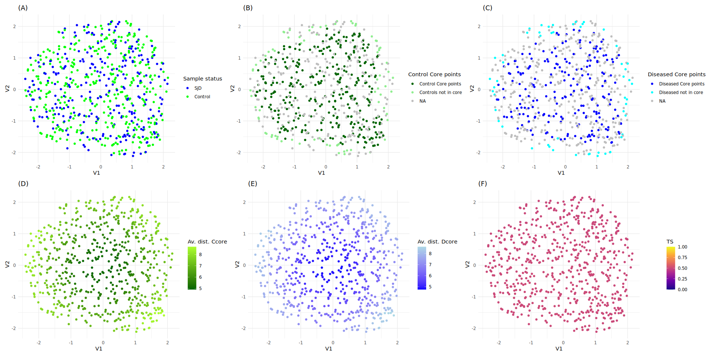
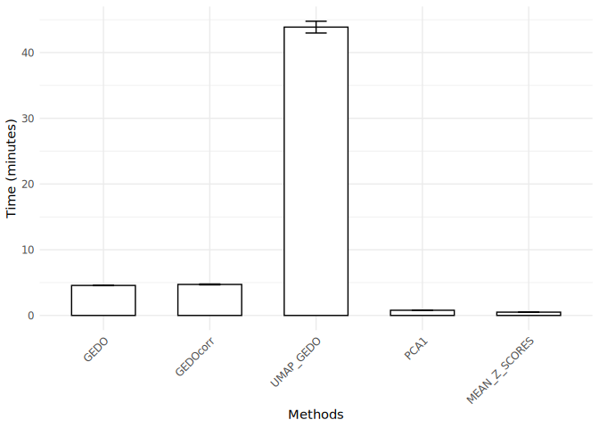

# GEDO - PRECISESADS

2025-05-30

# 1. Packages and functions

``` r
folder_script_to_source = "~/these_clement/studies/R_Thèse_clement_LBAI/11_GEDO/Script/"
source(file = paste0(folder_script_to_source,"GEDO.R"))
source(file = paste0(folder_script_to_source,"functions_article.R"))

detach_all_packages()
packages_list = c("data.table", "FNN", "magrittr", "tryCatchLog","rlist",
                  "igraph", "pbapply","rgl","rdist","msigdbr","msigdbdf",
                  "future.apply","dbscan", "progressr","pheatmap",
                  "gridExtra","MASS","plotly","ggplot2", "patchwork",
                  "caret","randomForest", "dplyr", "tidyr","parallel", "pROC", "ggpubr","fpc","cluster","phateR","reticulate", "devtools", "bench","RANN")

install_and_load(packages_list)
```

      data.table          FNN     magrittr  tryCatchLog        rlist       igraph 
            TRUE         TRUE         TRUE         TRUE         TRUE         TRUE 
         pbapply          rgl        rdist      msigdbr     msigdbdf future.apply 
            TRUE         TRUE         TRUE         TRUE         TRUE         TRUE 
          dbscan    progressr     pheatmap    gridExtra         MASS       plotly 
            TRUE         TRUE         TRUE         TRUE         TRUE         TRUE 
         ggplot2    patchwork        caret randomForest        dplyr        tidyr 
            TRUE         TRUE         TRUE         TRUE         TRUE         TRUE 
        parallel         pROC       ggpubr          fpc      cluster       phateR 
            TRUE         TRUE         TRUE         TRUE         TRUE         TRUE 
      reticulate     devtools        bench         RANN 
            TRUE         TRUE         TRUE         TRUE 

# 2. Loading data

``` r
PS_brutes <- readRDS("~/these_clement/studies/R_Thèse_clement_LBAI/0_Data/PRECISESADS/PS_phase_I_II/PS_brutes.rds")
rna_seq_data = readRDS("~/these_clement/studies/R_Thèse_clement_LBAI/0_Data/PRECISESADS/data_omics_PS/Data/Transcriptomics/data_batch_corrected/bulk_rna_seq_final_data_batch_corrected_high_cv_scaled.rds")
rna_seq_data[, SAMPLING_OMIC_NUMBER:=paste0("N",SAMPLING_OMIC_NUMBER)]
rna_seq_data[PS_brutes, diag := i.DIAGNOSIS_DISEASE_AT_ONSET, on="SAMPLING_OMIC_NUMBER"]
rna_seq_data[PS_brutes, control:=i.DIAGNOSIS_ARM, on="SAMPLING_OMIC_NUMBER"]
rna_seq_data[control=="Control", diag:="Control"]
rna_seq_data=rna_seq_data[,diag:=factor(diag, levels = c("Control","SjS"))]
rna_seq_data=rna_seq_data[diag %in% c("Control","SjS")]
rna_seq_data[diag=="SjS",diag:="SjD"]
diag = rna_seq_data$diag
PS_brutes[,diag:=DIAGNOSIS_DISEASE_AT_ONSET]
PS_brutes[DIAGNOSIS_ARM=="Control", diag:="Control"]
diag=factor(diag,levels=c("SjD","Control"))
omic_id = rna_seq_data$SAMPLING_OMIC_NUMBER
ifn_score_table=data.table(SAMPLING_OMIC_NUMBER=omic_id)
ifn_score_table[PS_brutes, IFN_score := i.EXPRESSION_PRECISESADS_IFN, on="SAMPLING_OMIC_NUMBER"]
ifn_score=ifn_score_table$IFN_score
rna_seq_data[, diag:=NULL][, SAMPLING_OMIC_NUMBER:=NULL][, control:=NULL]
```

# 3. Computing GEDO

## 3.1. Graph G with euclidean distances

``` r
folder_for_res = "~/these_clement/studies/R_Thèse_clement_LBAI/11_GEDO/Out/last_run_3/"
num_cores=5

if(file.exists(paste0(folder_for_res, "gedo_obj.rds"))){
  gedo_obj = readRDS(paste0(folder_for_res, "gedo_obj.rds"))
}else{
gedo_obj = gedo(data = rna_seq_data, diag = diag, reference_group = "Control",
            category = "C7",subcategory = "IMMUNESIGDB",k_lof = 30,
            core_pct = 0.9, k_graph = 15, dim_reduc_method="none", num_cores=num_cores,
            distance="euclidean")

saveRDS(gedo_obj, file=paste0(folder_for_res, "gedo_obj.rds"))
}
gedo_obj$diag=factor(diag,levels=c("SjD","Control"))
```

## 3.2. Graph G with correlation distances

``` r
if(file.exists(paste0(folder_for_res, "gedo_corr_obj.rds"))){
  gedo_corr_obj = readRDS(paste0(folder_for_res, "gedo_corr_obj.rds"))
}else{
gedo_corr_obj = gedo(data = rna_seq_data, diag = diag, reference_group = "Control",
            category = "C7",subcategory = "IMMUNESIGDB",k_lof = 30,
            core_pct = 0.9, k_graph = 15, dim_reduc_method="none", num_cores=num_cores,
            distance="correlation")

saveRDS(gedo_corr_obj, file=paste0(folder_for_res, "gedo_corr_obj.rds"))
}
gedo_corr_obj$diag=factor(diag,levels=c("SjD","Control"))
```

# 4. Computing UMAP - GEDO

``` r
if(file.exists(paste0(folder_for_res, "umap_gedo_obj.rds"))){
  umap_gedo_obj = readRDS(paste0(folder_for_res, "umap_gedo_obj.rds"))
}else{
umap_gedo_obj = gedo(data = rna_seq_data, diag = diag, reference_group = "Control",
            category = "C7",subcategory = "IMMUNESIGDB",k_lof = 30,
            core_pct = 0.9, k_graph = 15, dim_reduc_method="umap", ncomp = 10,
            dim_reduc_dist_method = "correlation", num_cores=num_cores,
            distance="euclidean")

saveRDS(umap_gedo_obj, file=paste0(folder_for_res, "umap_gedo_obj.rds"))
}
umap_gedo_obj$diag=factor(diag,levels=c("SjD","Control"))
```

# 5. GEDO functions

## Heatmap of GEDO module matrix :

``` r
heatmap_pdf_width=8.5
heatmap_pdf_height=8.5
heatmap_png_width=615
heatmap_png_height=615

pointsize=10


pdf(paste0(folder_for_res, "heatmap_gedo.pdf"), width = heatmap_pdf_width, height = heatmap_pdf_height, pointsize=pointsize)
print(heatmap.ifn(gedo_obj = gedo_obj, IFN_score=ifn_score))
```


``` r
dev.off()
```

    pdf 
      3 

``` r
png(paste0(folder_for_res, "heatmap_gedo.png"), width = heatmap_png_width, height = heatmap_png_height, pointsize=pointsize)
print(heatmap.ifn(gedo_obj = gedo_obj, IFN_score=ifn_score))
dev.off()
```

    pdf 
      3 

IFN score : Z-score of genes PRKR, IFIT1 and IFI44 expression
(interferon alpha induced genes)

## Heatmap of GEDOcorr module matrix :

``` r
pdf(paste0(folder_for_res, "heatmap_gedo_corr.pdf")) 
print(heatmap.ifn(gedo_obj = gedo_corr_obj, IFN_score=ifn_score), width = heatmap_pdf_width, height = heatmap_pdf_height, pointsize=pointsize) 
```


``` r
dev.off() 
```

    pdf 
      3 

``` r
png(paste0(folder_for_res, "heatmap_gedo_corr.png")) 
print(heatmap.ifn(gedo_obj = gedo_corr_obj, IFN_score=ifn_score), width = heatmap_pdf_width, height = heatmap_pdf_height, pointsize=pointsize) 
dev.off() 
```

    pdf 
      3 

IFN score : Z-score of genes PRKR, IFIT1 and IFI44 expression
(interferon alpha induced genes)

## Heatmap of UMAP-GEDO module matrix :

``` r
pdf(paste0(folder_for_res, "heatmap_umap_gedo.pdf"))
print(heatmap.ifn(gedo_obj = umap_gedo_obj, IFN_score=ifn_score), width = heatmap_pdf_width, height = heatmap_pdf_height, pointsize=pointsize)
```


``` r
dev.off()
```

    pdf 
      3 

``` r
png(paste0(folder_for_res, "heatmap_umap_gedo.png"))
print(heatmap.ifn(gedo_obj = umap_gedo_obj, IFN_score=ifn_score), width = heatmap_pdf_width, height = heatmap_pdf_height, pointsize=pointsize)
dev.off()
```

    pdf 
      3 

IFN score : Z-score of genes PRKR, IFIT1 and IFI44 expression
(interferon alpha induced genes)

## AUC of gene modules in GEDO module matrix :

``` r
auc = gedo.module.auc(gedo_obj)
```


``` r
ggsave(auc$plot_auc, file=paste0(folder_for_res, "auc_gedo.pdf"), width = 15)
```

# 6. Detail of transition score on GSE1740_UNSTIM_VS_IFNA_STIMULATED_MCSF_DERIVED_MACROPHAGE_DN module

``` r
module_name="GSE1740_UNSTIM_VS_IFNA_STIMULATED_MCSF_DERIVED_MACROPHAGE_DN"
plots_module = compute_transition_score(data = rna_seq_data, 
                                        module_name = module_name,
                                        diag = diag, 
                                        reference_group = "Control",
                                        charge_reactome_modules = T,
                                        k_lof = 30,
                                        core_pct = 0.8,
                                        k_graph = 15,
                                        dim_reduc_method="umap",
                                        ncomp=2,
                                        dim_reduc_dist_method="correlation",
                                        distance="euclidean",
                                        do_plot = T, scale_ts=F)
plot=plots_module$combined_plot
print(plot)
```


``` r
ggsave(plot,file=paste0(folder_for_res,"GSE1740_UNSTIM_VS_IFNA_STIMULATED_MCSF_DERIVED_MACROPHAGE_DN.pdf"), width =20, height = 10)
auc(gedo_obj$diag, plots_module$res$TS)
```

    Area under the curve: 0.9324

UMAP with uwot package in R, k=15, euclidean distances, colored by (A)
Status (CTRL or SjD), (B) Controls core points (Ccore: 70% more dense
points with Local Outlier Factor (k=30)), (C) SjD core points (Dcore,
same method as Controls), (D) Average of geodesic distance with Control
core points (ρC (x)), (E) Average of geodesic distance with SjD core
points (ρD (x)), (F) Transition score (TS).

## Random example to test for overfitting (gene expression values shuffled) :

``` r
module_name="GSE1740_UNSTIM_VS_IFNA_STIMULATED_MCSF_DERIVED_MACROPHAGE_DN"
plots_module_random = compute_transition_score(data = rna_seq_data, 
                                        module_name = module_name,
                                        diag = diag, 
                                        reference_group = "Control",
                                        k_lof = 35,
                                        core_pct = 0.8,
                                        k_graph = 15,
                                        dim_reduc_method="umap",
                                        ncomp=2,
                                        dim_reduc_dist_method="correlation",
                                        distance="euclidean",
                                        charge_reactome_modules = T,
                                        do_plot = T, scale_ts=F, shuffle = T)
```

    [1] "shuffling"

``` r
plot_random=plots_module_random$combined_plot
print(plot_random)
```



``` r
ggsave(plot_random,file=paste0(folder_for_res,"random_GSE1740_UNSTIM_VS_IFNA_STIMULATED_MCSF_DERIVED_MACROPHAGE_DN.pdf"), width = 20, height = 10)
auc(gedo_obj$diag, plots_module$res$TS)
```

    Area under the curve: 0.9324

UMAP with uwot package in R, k=15, euclidean distances, colored by (A)
Status (CTRL or SjD), (B) Controls core points (Ccore: 70% more dense
points with Local Outlier Factor (k=30)), (C) SjD core points (Dcore,
same method as Controls), (D) Average of geodesic distance with Control
core points (ρC (x)), (E) Average of geodesic distance with SjD core
points (ρD (x)), (F) Transition score (TS).

# 7. Computing module matrix with PCA1

``` r
if(file.exists(paste0(folder_for_res, "pca1_obj.rds"))){
pca1_module_matrix = readRDS(paste0(folder_for_res, "pca1_obj.rds"))
}else{
pca1_module_matrix = compute_module_matrix(method="pca1", data=rna_seq_data, 
                                           diag=diag, 
                                           reference_group="Control",
                                           category="C7",
                                           subcategory = "IMMUNESIGDB",
                                           num_cores=num_cores)

saveRDS(pca1_module_matrix, file=paste0(folder_for_res, "pca1_obj.rds"))
}
```

# 8. Computing module matrix with mean of z-scores

``` r
if(file.exists(paste0(folder_for_res, "mzscore_obj.rds"))){
  mean_z_score_module_matrix=readRDS(paste0(folder_for_res, "mzscore_obj.rds"))
}else{
mean_z_score_module_matrix = compute_module_matrix(method="mean_z_score", data=rna_seq_data, 
                                           diag=diag, 
                                           reference_group="Control",
                                           category="C7",
                                           subcategory = "IMMUNESIGDB",
                                           num_cores=num_cores)

saveRDS(mean_z_score_module_matrix, file=paste0(folder_for_res,"mzscore_obj.rds"))
}
```

# 9. Class prediction performance (SjD vs. CTRL) for each gene module

``` r
#| fig.width: 15
#| fig.height: 7
#| fig.align: "center"
matrix_list = list(GEDO=gedo_obj, GEDOcorr = gedo_corr_obj, UMAP_GEDO=umap_gedo_obj,
                   # PHATE_GEDO=phate_gedo_obj, 
                   PCA1=pca1_module_matrix, MEAN_Z_SCORES=mean_z_score_module_matrix)

res=compute_auc_modules(matrix_list = matrix_list)
print(res$plot)
```


``` r
plot=res$plot
ggsave(plot,file=paste0(folder_for_res,"module_auc_comparison.pdf"), height = 7, width = 15)
saveRDS(res, file=paste0(folder_for_res, "module_auc_comparison.rds"))
```

AUC analysis of each gene module to classify SjD vs. CTRL.

\(A\) AUC of ImmuneSigDB 4872 gene modules with GEDO, UMAP-GEDO, PCA1
and Mean of z-scores (significance by Wilcoxon test),

\(B\) AUC of gene modules in comparison with GEDO. Red line: x=y line.
Blue curve: quantile regression at the median (quantreg package in R,
lambda=0.1).

# 10. Module Matrices classification performance (SjD vs. CTRL)

``` r
#| fig.width: 15
#| fig.height: 15
#| fig.align: "center"


if(file.exists(paste0(folder_for_res,"rf_results.rds"))){
  rf_results=readRDS(paste0(folder_for_res,"rf_results.rds"))
}else{
rf_results = compute_prediction_with_ci(model = "rf", k=NULL, k_folds = 10, dt_list=matrix_list, num_cores=num_cores)
saveRDS(rf_results, file=paste0(folder_for_res, "rf_results.rds"))  
}

if(file.exists(paste0(folder_for_res,"knn_results.rds"))){
  knn_results=readRDS(paste0(folder_for_res,"knn_results.rds"))
}else{
knn_results = compute_prediction_with_ci(model = "knn", k=30, k_folds = 10, dt_list=matrix_list, num_cores=num_cores)
saveRDS(knn_results, file=paste0(folder_for_res, "knn_results.rds"))  
}


roc_combined <- rf_results$roc_curves + knn_results$roc_curves + plot_layout(ncol = 2)
  
ggsave(roc_combined,file=paste0(folder_for_res,"rocs_rf_knn.pdf"), width = 15, height = 15)
print(roc_combined)
```


ROC curves of modules matrices to classify SjD vs. CTRL.

\(A\) Prediction with Random Forest (randomForest package in R, with 400
trees and default parameters),

\(B\) Prediction with K-Nearest Neighbor algorithm (caret R package,
with k=30)

# 11. Heatmaps of module matrices

## With PCA1 :

``` r
pdf(paste0(folder_for_res, "heatmap_PCA1.pdf"))
print(heatmap.ifn(gedo_obj = pca1_module_matrix, IFN_score=ifn_score), width = heatmap_pdf_width, height = heatmap_pdf_height, pointsize=pointsize)
```


``` r
dev.off()
```

    pdf 
      3 

``` r
png(paste0(folder_for_res, "heatmap_PCA1.png"))
print(heatmap.ifn(gedo_obj = pca1_module_matrix, IFN_score=ifn_score), width = heatmap_pdf_width, height = heatmap_pdf_height, pointsize=pointsize)
dev.off()
```

    pdf 
      3 

IFN score : Z-score of genes PRKR, IFIT1 and IFI44 expression
(interferon alpha induced genes)

## With Mean of Z-scores :

``` r
#MEAN z SCORE
pdf(paste0(folder_for_res, "heatmap_mean_z_score.pdf"))
print(heatmap.ifn(gedo_obj = mean_z_score_module_matrix, IFN_score=ifn_score), width = heatmap_pdf_width, height = heatmap_pdf_height, pointsize=pointsize)
```


``` r
dev.off()
```

    pdf 
      3 

``` r
png(paste0(folder_for_res, "heatmap_mean_z_score.png"))
print(heatmap.ifn(gedo_obj = mean_z_score_module_matrix, IFN_score=ifn_score), width = heatmap_pdf_width, height = heatmap_pdf_height, pointsize=pointsize)
dev.off()
```

    pdf 
      3 

IFN score : Z-score of genes PRKR, IFIT1 and IFI44 expression
(interferon alpha induced genes)

# 12. Clustering quality evaluation

``` r
cl_res = compute_clustering_quality(matrix_list = matrix_list, num_cores=num_cores)
```

    GEDO
    GEDOcorr
    UMAP_GEDO
    PCA1
    MEAN_Z_SCORES

``` r
clustering_plot=cl_res$plot

res$boxplot <- res$boxplot + theme(plot.margin = unit(c(0, 0, 0, 0), "cm"))
res$combined_subplots <- res$combined_subplots + theme(plot.margin =  unit(c(0, 0, 0, 0), "cm"))
roc_combined <- roc_combined + theme(plot.margin =  unit(c(0, 0, 0, 0), "cm"))
clustering_plot <- clustering_plot + theme(plot.margin =  unit(c(0, 0, 0, 0), "cm"))


spacer <- plot_spacer()

cluster_row <- spacer + clustering_plot + spacer
cluster_row <- cluster_row + plot_layout(widths = c(0.2, 0.6, 0.2))


combined_plot <- 
  res$boxplot /
  spacer / 
  res$combined_subplots /
  spacer / 
  roc_combined /
  spacer / 
  cluster_row +
  plot_layout(heights = c(1, 0, 1, 0, 1, 0, 1))


print(combined_plot)
```


``` r
ggsave(combined_plot,file=paste0(folder_for_res,"module_auc_rocs_rf_knn_clustering.pdf" ), width = 15, height = 16)
```

Clustering quality with Average Silhouette Width (ASW) and
Calinski-Harabasz Index (CHI).

Dotted lines represent the mean value of each clustering metric across
the number of clusters, computed within each method.

# 13. Enrichment of clinical features in PHATE visualizations

## GEDO :

``` r
#| fig.width: 12
#| fig.height: 6
#| fig.align: "center"
use_python("/usr/bin/python3", required = TRUE)
plot_gedo= plot_phate(data=matrix_list$GEDO$module_matrix, k = 15, meta_data = PS_brutes)
ggsave(plot_gedo,file=paste0(folder_for_res,"phate_clinical_features_gedo.pdf"), width = 20, height = 10)
knitr::include_graphics(paste0(folder_for_res,"phate_clinical_features_gedo.pdf"))
```


PHATE projection of module matrix obtained with UMAP-GEDO with phateR R
package (k=15, euclidean distances), colored by : (A) Status (CTRL
vs. SjD), (B) IFN score, (C) Quantification of all SSA autoantibodies,
(D) Quantification SSA 52 autoantibodies, (E) Quantification of SSA 60
autoantibodies, (F) Quantification of SSB autoantibodies.

## GEDOcorr :

``` r
#| fig.width: 12
#| fig.height: 6
#| fig.align: "center"
use_python("/usr/bin/python3", required = TRUE)
plot_gedo_corr= plot_phate(data=matrix_list$GEDOcorr$module_matrix, k = 15, meta_data = PS_brutes)
ggsave(plot_gedo_corr,file=paste0(folder_for_res,"phate_clinical_features_gedo_corr.pdf"), width = 20, height = 10)
knitr::include_graphics(paste0(folder_for_res,"phate_clinical_features_gedo_corr.pdf"))
```


PHATE projection of module matrix obtained with GEDOcorr with phateR R
package (k=15, euclidean distances), colored by : (A) Status (CTRL
vs. SjD), (B) IFN score, (C) Quantification of all SSA autoantibodies,
(D) Quantification SSA 52 autoantibodies, (E) Quantification of SSA 60
autoantibodies, (F) Quantification of SSB autoantibodies.

## UMAP-GEDO :

``` r
use_python("/usr/bin/python3", required = TRUE)

plot_umap_gedo= plot_phate(data=matrix_list$UMAP_GEDO$module_matrix, k = 15, meta_data = PS_brutes)
ggsave(plot_umap_gedo,file=paste0(folder_for_res,"phate_clinical_features_umap_gedo.pdf"), width = 20, height = 10)
knitr::include_graphics(paste0(folder_for_res,"phate_clinical_features_umap_gedo.pdf"))
```

<embed
src="../these_clement/studies/R_Thèse_clement_LBAI/11_GEDO/Out/last_run_3/phate_clinical_features_umap_gedo.pdf"
data-fig-align="center" />

PHATE projection of module matrix obtained with UMAP-GEDO with phateR R
package (k=15, euclidean distances), colored by : (A) Status (CTRL
vs. SjD), (B) IFN score, (C) Quantification of all SSA autoantibodies,
(D) Quantification SSA 52 autoantibodies, (E) Quantification of SSA 60
autoantibodies, (F) Quantification of SSB autoantibodies.

## PCA1 :

``` r
#| fig.width: 12
#| fig.height: 6
#| fig.align: "center"
use_python("/usr/bin/python3", required = TRUE)

plot_pca1= plot_phate(data=matrix_list$PCA1$module_matrix, k = 15, meta_data = PS_brutes)
ggsave(plot_pca1,file=paste0(folder_for_res,"phate_clinical_features_pca1.pdf"), width = 20, height = 10)
knitr::include_graphics(paste0(folder_for_res,"phate_clinical_features_pca1.pdf"))
```


PHATE projection of module matrix obtained with UMAP-GEDO with phateR R
package (k=15, euclidean distances), colored by : (A) Status (CTRL
vs. SjD), (B) IFN score, (C) Quantification of all SSA autoantibodies,
(D) Quantification SSA 52 autoantibodies, (E) Quantification of SSA 60
autoantibodies, (F) Quantification of SSB autoantibodies.

## MEAN OF Z-SCORES :

``` r
#| fig.width: 12
#| fig.height: 6
#| fig.align: "center"
use_python("/usr/bin/python3", required = TRUE)
plot_mean_zscore= plot_phate(data=matrix_list$MEAN_Z_SCORES$module_matrix, k = 15, meta_data = PS_brutes)
ggsave(plot_mean_zscore,file=paste0(folder_for_res,"phate_clinical_features_mean_z_score.pdf"), width = 20, height = 10)
knitr::include_graphics(paste0(folder_for_res,"phate_clinical_features_mean_z_score.pdf"))
```


PHATE projection of module matrix obtained with UMAP-GEDO with phateR R
package (k=15, euclidean distances), colored by : (A) Status (CTRL
vs. SjD), (B) IFN score, (C) Quantification of all SSA autoantibodies,
(D) Quantification SSA 52 autoantibodies, (E) Quantification of SSA 60
autoantibodies, (F) Quantification of SSB autoantibodies.

# 14. Benchmark methods (time of running)

``` r
if(file.exists(paste0(folder_for_res, "benchmark_time.rds"))){
  bench_result=readRDS(paste0(folder_for_res, "benchmark_time.rds"))
}else{
bench_result = bench::mark(
  
GEDO = gedo(data = rna_seq_data, diag = diag, reference_group = "Control",
            category = "C7",subcategory = "IMMUNESIGDB",k_lof = 30,
            core_pct = 0.9, k_graph = 15, dim_reduc_method="none", num_cores=num_cores,
            distance="euclidean"),
  
GEDOcorr = gedo(data = rna_seq_data, diag = diag, reference_group = "Control",
            category = "C7",subcategory = "IMMUNESIGDB",k_lof = 30,
            core_pct = 0.9, k_graph = 15, dim_reduc_method="none", num_cores=num_cores,
            distance="correlation"),


UMAP_GEDO = gedo(data = rna_seq_data, diag = diag, reference_group = "Control",
            category = "C7",subcategory = "IMMUNESIGDB",k_lof = 30,
            core_pct = 0.9, k_graph = 15, dim_reduc_method="umap", ncomp = 10,
            dim_reduc_dist_method = "correlation", num_cores=num_cores,
            distance="euclidean"),
  
PCA1 = compute_module_matrix(method="pca1", data=rna_seq_data, 
  diag=diag, 
  reference_group="Control",
  category="C7",
  subcategory = "IMMUNESIGDB",
  num_cores=num_cores),
  

MEAN_Z_SCORES = compute_module_matrix(method="mean_z_score", 
  data=rna_seq_data, 
  diag=diag, 
  reference_group="Control",
  category="C7",
  subcategory = "IMMUNESIGDB",
  num_cores=num_cores),
  
iterations = 3,
check = F
)
saveRDS(bench_result, file=paste0(folder_for_res, "benchmark_time.rds"))
}
results_tib <- as_tibble(bench_result)
results_long <- results_tib %>%
  unnest(cols = time) %>%
  mutate(minutes = as.numeric(time, units = "mins")) %>%
  mutate(minutes = as.numeric(time) / 60)

summary_stats <- data.table(results_long %>%
  group_by(expression) %>%
  summarise(
    median_minutes = median(minutes),
    mean_minutes = mean(minutes),
    sd_minutes = sd(minutes),
    se_minutes = sd_minutes / sqrt(n())
  ))
summary_stats$expression = factor(names(matrix_list), levels = names(matrix_list))


plot = ggplot(summary_stats, aes(x = expression, y = median_minutes)) +
  geom_bar(stat = "identity", fill = "white", color = "black", width = 0.6) + 
  geom_errorbar(aes(ymin = median_minutes - se_minutes, ymax = median_minutes + se_minutes),width = 0.2, color = "black") +
  labs(x = "Methods",
       y = "Time (minutes)") +
  theme_minimal() +
  theme(axis.text.x = element_text(angle = 45, hjust = 1))
print(plot)
```



``` r
ggsave(plot,file=paste0(folder_for_res, "benchmark_res.pdf"))
```

# 15. Session information, Packages and versions

``` r
devtools::session_info()
```

    ─ Session info ───────────────────────────────────────────────────────────────
     setting  value
     version  R version 4.3.3 (2024-02-29)
     os       Ubuntu 24.04.2 LTS
     system   x86_64, linux-gnu
     ui       X11
     language (EN)
     collate  en_US.UTF-8
     ctype    en_US.UTF-8
     tz       Europe/Paris
     date     2025-05-30
     pandoc   3.1.1 @ /usr/lib/rstudio-server/bin/quarto/bin/tools/ (via rmarkdown)
     quarto   1.5.48 @ /usr/local/bin/quarto

    ─ Packages ───────────────────────────────────────────────────────────────────
     package        * version    date (UTC) lib source
     abind            1.4-8      2024-09-12 [1] CRAN (R 4.3.3)
     assertthat       0.2.1      2019-03-21 [1] CRAN (R 4.3.3)
     babelgene        22.9       2022-09-29 [1] CRAN (R 4.3.3)
     backports        1.5.0      2024-05-23 [1] CRAN (R 4.3.3)
     base64enc        0.1-3      2015-07-28 [1] CRAN (R 4.3.3)
     bench          * 1.1.4      2025-01-16 [1] CRAN (R 4.3.3)
     broom            1.0.8      2025-03-28 [1] CRAN (R 4.3.3)
     cachem           1.1.0      2024-05-16 [1] CRAN (R 4.3.3)
     car              3.1-3      2024-09-27 [1] CRAN (R 4.3.3)
     carData          3.0-5      2022-01-06 [1] CRAN (R 4.3.3)
     caret          * 7.0-1      2024-12-10 [1] CRAN (R 4.3.3)
     class            7.3-23     2025-01-01 [1] CRAN (R 4.3.3)
     cli              3.6.4      2025-02-13 [1] CRAN (R 4.3.3)
     cluster        * 2.1.8.1    2025-03-12 [1] CRAN (R 4.3.3)
     codetools        0.2-20     2024-03-31 [1] CRAN (R 4.3.3)
     colorspace       2.1-1      2024-07-26 [1] CRAN (R 4.3.3)
     data.table     * 1.17.0     2025-02-22 [1] CRAN (R 4.3.3)
     dbscan         * 1.2.2      2025-01-26 [1] CRAN (R 4.3.3)
     DEoptimR         1.1-3-1    2024-11-23 [1] CRAN (R 4.3.3)
     devtools       * 2.4.5      2022-10-11 [1] CRAN (R 4.3.3)
     digest           0.6.37     2024-08-19 [1] CRAN (R 4.3.3)
     diptest          0.77-1     2024-04-10 [1] CRAN (R 4.3.3)
     dplyr          * 1.1.4      2023-11-17 [1] CRAN (R 4.3.3)
     ellipsis         0.3.2      2021-04-29 [1] CRAN (R 4.3.3)
     evaluate         1.0.3      2025-01-10 [1] CRAN (R 4.3.3)
     farver           2.1.2      2024-05-13 [1] CRAN (R 4.3.3)
     fastmap          1.2.0      2024-05-15 [1] CRAN (R 4.3.3)
     flexmix          2.3-20     2025-02-28 [1] CRAN (R 4.3.3)
     FNN            * 1.1.4.1    2024-09-22 [1] CRAN (R 4.3.3)
     foreach          1.5.2      2022-02-02 [1] CRAN (R 4.3.3)
     formatR          1.14       2023-01-17 [1] CRAN (R 4.3.3)
     Formula          1.2-5      2023-02-24 [1] CRAN (R 4.3.3)
     fpc            * 2.2-13     2024-09-24 [1] CRAN (R 4.3.3)
     fs               1.6.5      2024-10-30 [1] CRAN (R 4.3.3)
     futile.logger    1.4.3      2016-07-10 [1] CRAN (R 4.3.3)
     futile.options   1.0.1      2018-04-20 [1] CRAN (R 4.3.3)
     future         * 1.34.0     2024-07-29 [1] CRAN (R 4.3.3)
     future.apply   * 1.11.3     2024-10-27 [1] CRAN (R 4.3.3)
     generics         0.1.3      2022-07-05 [1] CRAN (R 4.3.3)
     ggplot2        * 3.5.1      2024-04-23 [1] CRAN (R 4.3.3)
     ggpubr         * 0.6.0      2023-02-10 [1] CRAN (R 4.3.3)
     ggsignif         0.6.4      2022-10-13 [1] CRAN (R 4.3.3)
     globals          0.16.3     2024-03-08 [1] CRAN (R 4.3.3)
     glue             1.8.0      2024-09-30 [1] CRAN (R 4.3.3)
     gower            1.0.2      2024-12-17 [1] CRAN (R 4.3.3)
     gridExtra      * 2.3        2017-09-09 [1] CRAN (R 4.3.3)
     gtable           0.3.6      2024-10-25 [1] CRAN (R 4.3.3)
     hardhat          1.4.1      2025-01-31 [1] CRAN (R 4.3.3)
     hms              1.1.3      2023-03-21 [1] CRAN (R 4.3.3)
     htmltools        0.5.8.1    2024-04-04 [1] CRAN (R 4.3.3)
     htmlwidgets      1.6.4      2023-12-06 [1] CRAN (R 4.3.3)
     httpuv           1.6.15     2024-03-26 [1] CRAN (R 4.3.3)
     httr             1.4.7      2023-08-15 [1] CRAN (R 4.3.3)
     igraph         * 2.1.4      2025-01-23 [1] CRAN (R 4.3.3)
     ipred            0.9-15     2024-07-18 [1] CRAN (R 4.3.3)
     irlba            2.3.5.1    2022-10-03 [1] CRAN (R 4.3.3)
     iterators        1.0.14     2022-02-05 [1] CRAN (R 4.3.3)
     jsonlite         2.0.0      2025-03-27 [1] CRAN (R 4.3.3)
     kernlab          0.9-33     2024-08-13 [1] CRAN (R 4.3.3)
     knitr            1.50       2025-03-16 [1] CRAN (R 4.3.3)
     labeling         0.4.3      2023-08-29 [1] CRAN (R 4.3.3)
     lambda.r         1.2.4      2019-09-18 [1] CRAN (R 4.3.3)
     later            1.4.1      2024-11-27 [1] CRAN (R 4.3.3)
     lattice        * 0.22-6     2024-03-20 [1] CRAN (R 4.3.3)
     lava             1.8.1      2025-01-12 [1] CRAN (R 4.3.3)
     lazyeval         0.2.2      2019-03-15 [1] CRAN (R 4.3.3)
     lifecycle        1.0.4      2023-11-07 [1] CRAN (R 4.3.3)
     listenv          0.9.1      2024-01-29 [1] CRAN (R 4.3.3)
     lubridate        1.9.4      2024-12-08 [1] CRAN (R 4.3.3)
     magrittr       * 2.0.3      2022-03-30 [1] CRAN (R 4.3.3)
     MASS           * 7.3-60.0.1 2024-01-13 [1] CRAN (R 4.3.2)
     Matrix         * 1.6-5      2024-01-11 [1] CRAN (R 4.3.2)
     MatrixModels     0.5-4      2025-03-26 [1] CRAN (R 4.3.3)
     mclust           6.1.1      2024-04-29 [1] CRAN (R 4.3.3)
     memoise          2.0.1      2021-11-26 [1] CRAN (R 4.3.3)
     mime             0.13       2025-03-17 [1] CRAN (R 4.3.3)
     miniUI           0.1.1.1    2018-05-18 [1] CRAN (R 4.3.3)
     ModelMetrics     1.2.2.2    2020-03-17 [1] CRAN (R 4.3.3)
     modeltools       0.2-23     2020-03-05 [1] CRAN (R 4.3.3)
     msigdbdf       * 24.1.0     2025-04-02 [1] https://igordot.r-universe.dev (R 4.3.3)
     msigdbr        * 10.0.1     2025-04-02 [1] https://igordot.r-universe.dev (R 4.3.3)
     munsell          0.5.1      2024-04-01 [1] CRAN (R 4.3.3)
     nlme             3.1-168    2025-03-31 [1] CRAN (R 4.3.3)
     nnet             7.3-20     2025-01-01 [1] CRAN (R 4.3.3)
     parallelly       1.43.0     2025-03-24 [1] CRAN (R 4.3.3)
     patchwork      * 1.3.0      2024-09-16 [1] CRAN (R 4.3.3)
     pbapply        * 1.7-2      2023-06-27 [1] CRAN (R 4.3.3)
     phateR         * 1.0.7      2021-02-12 [1] CRAN (R 4.3.3)
     pheatmap       * 1.0.12     2019-01-04 [1] CRAN (R 4.3.3)
     pillar           1.10.1     2025-01-07 [1] CRAN (R 4.3.3)
     pkgbuild         1.4.7      2025-03-24 [1] CRAN (R 4.3.3)
     pkgconfig        2.0.3      2019-09-22 [1] CRAN (R 4.3.3)
     pkgload          1.4.0      2024-06-28 [1] CRAN (R 4.3.3)
     plotly         * 4.10.4     2024-01-13 [1] CRAN (R 4.3.3)
     plyr             1.8.9      2023-10-02 [1] CRAN (R 4.3.3)
     png              0.1-8      2022-11-29 [1] CRAN (R 4.3.3)
     prabclus         2.3-4      2024-09-24 [1] CRAN (R 4.3.3)
     pROC           * 1.18.5     2023-11-01 [1] CRAN (R 4.3.3)
     prodlim          2024.06.25 2024-06-24 [1] CRAN (R 4.3.3)
     profvis          0.4.0      2024-09-20 [1] CRAN (R 4.3.3)
     progressr      * 0.15.1     2024-11-22 [1] CRAN (R 4.3.3)
     promises         1.3.2      2024-11-28 [1] CRAN (R 4.3.3)
     purrr            1.0.4      2025-02-05 [1] CRAN (R 4.3.3)
     quantreg         6.1        2025-03-10 [1] CRAN (R 4.3.3)
     R6               2.6.1      2025-02-15 [1] CRAN (R 4.3.3)
     ragg             1.4.0      2025-04-10 [1] CRAN (R 4.3.3)
     randomForest   * 4.7-1.2    2024-09-22 [1] CRAN (R 4.3.3)
     RANN           * 2.6.2      2024-08-25 [1] CRAN (R 4.3.3)
     RColorBrewer     1.1-3      2022-04-03 [1] CRAN (R 4.3.3)
     Rcpp             1.0.14     2025-01-12 [1] CRAN (R 4.3.3)
     RcppAnnoy        0.0.22     2024-01-23 [1] CRAN (R 4.3.3)
     rdist          * 0.0.5      2020-05-04 [1] CRAN (R 4.3.3)
     readr            2.1.5      2024-01-10 [1] CRAN (R 4.3.3)
     recipes          1.2.1      2025-03-25 [1] CRAN (R 4.3.3)
     remotes          2.5.0      2024-03-17 [1] CRAN (R 4.3.3)
     reshape2         1.4.4      2020-04-09 [1] CRAN (R 4.3.3)
     reticulate     * 1.42.0     2025-03-25 [1] CRAN (R 4.3.3)
     rgl            * 1.3.18     2025-03-28 [1] CRAN (R 4.3.3)
     rlang            1.1.5      2025-01-17 [1] CRAN (R 4.3.3)
     rlist          * 0.4.6.2    2021-09-03 [1] CRAN (R 4.3.3)
     rmarkdown        2.29       2024-11-04 [1] CRAN (R 4.3.3)
     robustbase       0.99-4-1   2024-09-27 [1] CRAN (R 4.3.3)
     rpart            4.1.24     2025-01-07 [1] CRAN (R 4.3.3)
     rstatix          0.7.2      2023-02-01 [1] CRAN (R 4.3.3)
     rstudioapi       0.17.1     2024-10-22 [1] CRAN (R 4.3.3)
     scales           1.3.0      2023-11-28 [1] CRAN (R 4.3.3)
     sessioninfo      1.2.3      2025-02-05 [1] CRAN (R 4.3.3)
     shiny            1.10.0     2024-12-14 [1] CRAN (R 4.3.3)
     SparseM          1.84-2     2024-07-17 [1] CRAN (R 4.3.3)
     stringi          1.8.7      2025-03-27 [1] CRAN (R 4.3.3)
     stringr          1.5.1      2023-11-14 [1] CRAN (R 4.3.3)
     survival         3.8-3      2024-12-17 [1] CRAN (R 4.3.3)
     systemfonts      1.2.2      2025-04-04 [1] CRAN (R 4.3.3)
     textshaping      1.0.0      2025-01-20 [1] CRAN (R 4.3.3)
     tibble           3.2.1      2023-03-20 [1] CRAN (R 4.3.3)
     tidyr          * 1.3.1      2024-01-24 [1] CRAN (R 4.3.3)
     tidyselect       1.2.1      2024-03-11 [1] CRAN (R 4.3.3)
     timechange       0.3.0      2024-01-18 [1] CRAN (R 4.3.3)
     timeDate         4041.110   2024-09-22 [1] CRAN (R 4.3.3)
     tryCatchLog    * 1.3.1      2021-10-25 [1] CRAN (R 4.3.3)
     tzdb             0.5.0      2025-03-15 [1] CRAN (R 4.3.3)
     urlchecker       1.0.1      2021-11-30 [1] CRAN (R 4.3.3)
     usethis        * 3.1.0      2024-11-26 [1] CRAN (R 4.3.3)
     uwot             0.2.3      2025-02-24 [1] CRAN (R 4.3.3)
     vctrs            0.6.5      2023-12-01 [1] CRAN (R 4.3.3)
     viridisLite      0.4.2      2023-05-02 [1] CRAN (R 4.3.3)
     withr            3.0.2      2024-10-28 [1] CRAN (R 4.3.3)
     xfun             0.51       2025-02-19 [1] CRAN (R 4.3.3)
     xtable           1.8-4      2019-04-21 [1] CRAN (R 4.3.3)
     yaml             2.3.10     2024-07-26 [1] CRAN (R 4.3.3)

     [1] /usr/lib/R/library
     [2] /usr/local/lib/R/site-library
     [3] /usr/lib/R/site-library
     * ── Packages attached to the search path.

    ─ Python configuration ───────────────────────────────────────────────────────
     python:         /usr/bin/python3
     libpython:      /usr/lib/python3.12/config-3.12-x86_64-linux-gnu/libpython3.12.so
     pythonhome:     //usr://usr
     version:        3.12.3 (main, Feb  4 2025, 14:48:35) [GCC 13.3.0]
     numpy:          /home/clem/.local/lib/python3.12/site-packages/numpy
     numpy_version:  1.26.4
     phate:          /home/clem/.local/lib/python3.12/site-packages/phate
     
     NOTE: Python version was forced by use_python() function

    ──────────────────────────────────────────────────────────────────────────────
