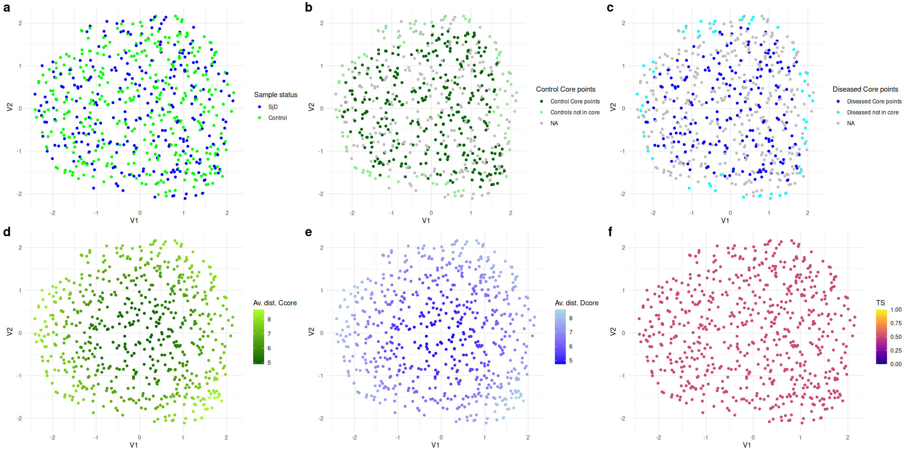
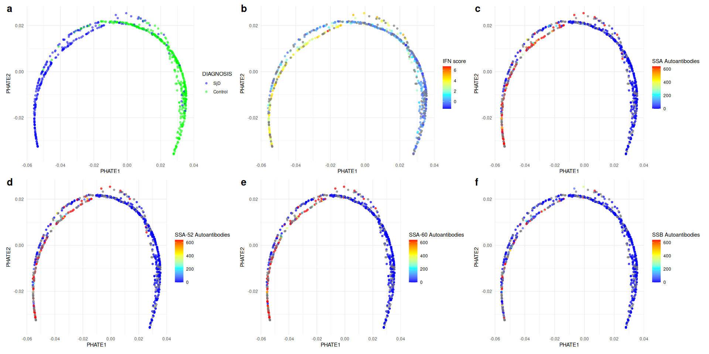

# GEDO - PRECISESADS

2025-07-18

``` r
#| label: setup
#| include: false
knitr::opts_chunk$set(fig.path = "../docs/figures/tutorial_")
```

# 1. Packages and functions

``` r
folder_script_to_source = "/home/clem/GEDO/R/"
source(file = paste0(folder_script_to_source,"GEDO.R"))
source(file = paste0(folder_script_to_source,"functions_article.R"))

detach_all_packages()
packages_list = c("data.table", "FNN", "magrittr", "tryCatchLog","rlist",
                  "igraph", "pbapply","rgl","rdist","msigdbr","msigdbdf",
                  "future.apply","dbscan", "progressr","pheatmap",
                  "gridExtra","MASS","plotly","ggplot2", "patchwork",
                  "caret","randomForest", "dplyr", "tidyr","parallel", "pROC", "ggpubr","fpc","cluster","phateR","reticulate", "devtools", "bench","RANN", "GSVA", "BiocParallel", "visdat", "magick", "ggbreak","cowplot","grid")

install_and_load(packages_list)
```

      data.table          FNN     magrittr  tryCatchLog        rlist       igraph 
            TRUE         TRUE         TRUE         TRUE         TRUE         TRUE 
         pbapply          rgl        rdist      msigdbr     msigdbdf future.apply 
            TRUE         TRUE         TRUE         TRUE         TRUE         TRUE 
          dbscan    progressr     pheatmap    gridExtra         MASS       plotly 
            TRUE         TRUE         TRUE         TRUE         TRUE         TRUE 
         ggplot2    patchwork        caret randomForest        dplyr        tidyr 
            TRUE         TRUE         TRUE         TRUE         TRUE         TRUE 
        parallel         pROC       ggpubr          fpc      cluster       phateR 
            TRUE         TRUE         TRUE         TRUE         TRUE         TRUE 
      reticulate     devtools        bench         RANN         GSVA BiocParallel 
            TRUE         TRUE         TRUE         TRUE         TRUE         TRUE 
          visdat       magick      ggbreak      cowplot         grid 
            TRUE         TRUE         TRUE         TRUE         TRUE 

# 2. Loading data

``` r
folder_to_data ="/home/clem/GEDO/data/"
PS_brutes <- readRDS(paste0(folder_to_data,"PS_brutes.rds"))
rna_seq_data = readRDS(paste0(folder_to_data, "bulk_rna_seq_final_data_batch_corrected_high_cv_scaled.rds"))
rna_seq_data[, SAMPLING_OMIC_NUMBER:=paste0("N",SAMPLING_OMIC_NUMBER)]
rna_seq_data[PS_brutes, diag := i.DIAGNOSIS_DISEASE_AT_ONSET, on="SAMPLING_OMIC_NUMBER"]
rna_seq_data[PS_brutes, control:=i.DIAGNOSIS_ARM, on="SAMPLING_OMIC_NUMBER"]
rna_seq_data[control=="Control", diag:="Control"]
rna_seq_data=rna_seq_data[,diag:=factor(diag, levels = c("Control","SjS"))]
rna_seq_data=rna_seq_data[diag %in% c("Control","SjS")]
rna_seq_data[diag=="SjS",diag:="SjD"]
diag = rna_seq_data$diag
PS_brutes[,diag:=DIAGNOSIS_DISEASE_AT_ONSET]
PS_brutes[DIAGNOSIS_ARM=="Control", diag:="Control"]
diag=factor(diag,levels=c("SjD","Control"))
omic_id = rna_seq_data$SAMPLING_OMIC_NUMBER
ifn_score_table=data.table(SAMPLING_OMIC_NUMBER=omic_id)
ifn_score_table[PS_brutes, IFN_score := i.EXPRESSION_PRECISESADS_IFN, on="SAMPLING_OMIC_NUMBER"]
ifn_score=ifn_score_table$IFN_score
rna_seq_data[, diag:=NULL][, SAMPLING_OMIC_NUMBER:=NULL][, control:=NULL]
folder_for_res = "/home/clem/GEDO/results/"
num_cores=3
```

``` r
  dt <- copy(rna_seq_data)   
  set.seed(123)             
  n_genes <- ncol(dt)
  n_indiv <- nrow(dt)
  
  #Random selection
  genes_idx <- sample(n_genes, floor(0.75 * n_genes))
  indiv_idx <- sample(n_indiv, floor(0.50 * n_indiv))
  
  #Bias creation
  bias_matrix <- matrix(
    rnorm(length(indiv_idx) * length(genes_idx), mean = 1.5, sd = 1),
    nrow = length(indiv_idx),
    ncol = length(genes_idx)
  )
  
  #Bias application
  dt_biased <- as.matrix(copy(dt))
  dt_biased[indiv_idx, genes_idx] <- dt_biased[indiv_idx, genes_idx] + bias_matrix
  rna_seq_data_noized=data.table(dt_biased)
  
  #Differences 
  mat_orig   <- as.matrix(dt)
  mat_noised <- as.matrix(rna_seq_data_noized)
  modif_num  <- (mat_orig != mat_noised) * 1
  pct_modif  <- sum(modif_num) / prod(dim(modif_num)) * 100
  message(sprintf("Modified cells : %.1f%%", pct_modif))
  
  
  diff_matrix = as.matrix(rna_seq_data)==as.matrix(rna_seq_data_noized)
  diff_matrix[diff_matrix== FALSE] <- NA
    
  plot_noized_data <- vis_miss(
      data.table(diff_matrix),
      cluster         = TRUE,
      sort_miss       = TRUE,
      warn_large_data = FALSE
    )
    
    plot_noized_data=plot_noized_data +
      labs(x = "genes", y = "individuals") +
      scale_fill_manual(
        name   = "RNAseq data",                
        values = c("FALSE" = "grey95",    
                   "TRUE"  = "#238A8DFF"),   
        breaks = c(FALSE, TRUE),          
        labels = c("Identical", "Biased") 
      ) +
      theme(
        axis.text.x = element_blank(),
        axis.text.y = element_blank(),
        axis.ticks  = element_blank(),
        panel.grid  = element_blank(),
        plot.title=element_text(face="bold")
      )
    
  saveRDS(object = as_grob(plot_noized_data), file=paste0(folder_for_res,"f.rds"))

  
  #Standardisation between 0 and 1
  rna_seq_data_noized[, (names(rna_seq_data_noized)) := lapply(.SD, function(x) (x - min(x, na.rm=TRUE)) / (max(x, na.rm=TRUE) - min(x, na.rm=TRUE))), .SDcols = names(rna_seq_data_noized)]
  
  
  #Verification
  cat(sprintf("Bias applied on  %d genes × %d individuals\n",
              length(genes_idx), length(indiv_idx)))
```

    Bias applied on  7500 genes × 323 individuals

``` r
  rm(dt_biased)
```

# 3. Computing GEDO

## 3.1. Graph G with euclidean distances

``` r
if(file.exists(paste0(folder_for_res, "gedo_obj.rds"))){
  gedo_obj = readRDS(paste0(folder_for_res, "gedo_obj.rds"))
}else{
gedo_obj = gedo(data = rna_seq_data, diag = diag, reference_group = "Control",
            category = "C7",subcategory = "IMMUNESIGDB",k_lof = 30,
            core_pct = 0.9, k_graph = 15, dim_reduc_method="none", num_cores=num_cores,
            distance="euclidean")

saveRDS(gedo_obj, file=paste0(folder_for_res, "gedo_obj.rds"))
}
gedo_obj$diag=factor(diag,levels=c("SjD","Control"))
```

``` r
if(file.exists(paste0(folder_for_res, "noized_gedo_obj.rds"))){
  noized_gedo_obj = readRDS(paste0(folder_for_res, "noized_gedo_obj.rds"))
}else{
noized_gedo_obj = gedo(data = rna_seq_data_noized, diag = diag, reference_group = "Control",
            category = "C7",subcategory = "IMMUNESIGDB",k_lof = 30,
            core_pct = 0.9, k_graph = 15, dim_reduc_method="none", num_cores=num_cores,
            distance="euclidean")

saveRDS(noized_gedo_obj, file=paste0(folder_for_res, "noized_gedo_obj.rds"))
}
noized_gedo_obj$diag=factor(diag,levels=c("SjD","Control"))
```

## 3.2. Graph G with correlation distances

``` r
if(file.exists(paste0(folder_for_res, "gedo_corr_obj.rds"))){
  gedo_corr_obj = readRDS(paste0(folder_for_res, "gedo_corr_obj.rds"))
}else{
gedo_corr_obj = gedo(data = rna_seq_data, diag = diag, reference_group = "Control",
            category = "C7",subcategory = "IMMUNESIGDB",k_lof = 30,
            core_pct = 0.9, k_graph = 15, dim_reduc_method="none", num_cores=num_cores,
            distance="correlation")

saveRDS(gedo_corr_obj, file=paste0(folder_for_res, "gedo_corr_obj.rds"))
}
gedo_corr_obj$diag=factor(diag,levels=c("SjD","Control"))
```

``` r
if(file.exists(paste0(folder_for_res, "noized_gedo_corr_obj.rds"))){
  noized_gedo_corr_obj = readRDS(paste0(folder_for_res, "noized_gedo_corr_obj.rds"))
}else{
noized_gedo_corr_obj = gedo(data = rna_seq_data_noized, diag = diag, reference_group = "Control",
            category = "C7",subcategory = "IMMUNESIGDB",k_lof = 30,
            core_pct = 0.9, k_graph = 15, dim_reduc_method="none", num_cores=num_cores,
            distance="correlation")

saveRDS(noized_gedo_corr_obj, file=paste0(folder_for_res, "noized_gedo_corr_obj.rds"))
}
noized_gedo_corr_obj$diag=factor(diag,levels=c("SjD","Control"))
```

# 4. Computing UMAP - GEDO

``` r
if(file.exists(paste0(folder_for_res, "umap_gedo_obj.rds"))){
  umap_gedo_obj = readRDS(paste0(folder_for_res, "umap_gedo_obj.rds"))
}else{
umap_gedo_obj = gedo(data = rna_seq_data, diag = diag, reference_group = "Control",
            category = "C7",subcategory = "IMMUNESIGDB",k_lof = 30,
            core_pct = 0.9, k_graph = 15, dim_reduc_method="umap", ncomp = 10,
            dim_reduc_dist_method = "correlation", num_cores=num_cores,
            distance="euclidean")

saveRDS(umap_gedo_obj, file=paste0(folder_for_res, "umap_gedo_obj.rds"))
}
umap_gedo_obj$diag=factor(diag,levels=c("SjD","Control"))
```

``` r
if(file.exists(paste0(folder_for_res, "noized_umap_gedo_obj.rds"))){
  noized_umap_gedo_obj = readRDS(paste0(folder_for_res, "noized_umap_gedo_obj.rds"))
}else{
noized_umap_gedo_obj = gedo(data = rna_seq_data_noized, diag = diag, reference_group = "Control",
            category = "C7",subcategory = "IMMUNESIGDB",k_lof = 30,
            core_pct = 0.9, k_graph = 15, dim_reduc_method="umap", ncomp = 10,
            dim_reduc_dist_method = "correlation", num_cores=num_cores,
            distance="euclidean")

saveRDS(noized_umap_gedo_obj, file=paste0(folder_for_res, "noized_umap_gedo_obj.rds"))
}
noized_umap_gedo_obj$diag=factor(diag,levels=c("SjD","Control"))
```

## AUC of gene modules in GEDO module matrix :

``` r
auc = gedo.module.auc(gedo_obj)
```


``` r
saveRDS(auc, file=paste0(folder_for_res, "auc_modules.rds"))
ggsave(auc$plot_auc, file=paste0(folder_for_res, "auc_gedo.pdf"), width = 15)
```

# 6. Detail of transition score on GSE1740_UNSTIM_VS_IFNA_STIMULATED_MCSF_DERIVED_MACROPHAGE_DN module

``` r
module_name="GSE1740_UNSTIM_VS_IFNA_STIMULATED_MCSF_DERIVED_MACROPHAGE_DN"
plots_module = compute_transition_score(data = rna_seq_data,
                                        module_name = module_name,
                                        diag = diag,
                                        reference_group = "Control",
                                        charge_reactome_modules = T,
                                        k_lof = 30,
                                        core_pct = 0.8,
                                        k_graph = 15,
                                        dim_reduc_method="umap",
                                        ncomp=2,
                                        dim_reduc_dist_method="correlation",
                                        distance="euclidean",
                                        do_plot = T, scale_ts=F)
plot=plots_module$combined_plot
print(plot)
```


``` r
ggsave(plot,file=paste0(folder_for_res,"GSE1740_UNSTIM_VS_IFNA_STIMULATED_MCSF_DERIVED_MACROPHAGE_DN.pdf"), width =20, height = 10)
auc(gedo_obj$diag, plots_module$res$TS)
```

    Area under the curve: 0.9324

UMAP with uwot package in R, k=15, euclidean distances, colored by (A)
Status (CTRL or SjD), (B) Controls core points (Ccore: 70% more dense
points with Local Outlier Factor (k=30)), (C) SjD core points (Dcore,
same method as Controls), (D) Average of geodesic distance with Control
core points (ρC (x)), (E) Average of geodesic distance with SjD core
points (ρD (x)), (F) Transition score (TS).

## Random example to test for overfitting (gene expression values shuffled) :

``` r
module_name="GSE1740_UNSTIM_VS_IFNA_STIMULATED_MCSF_DERIVED_MACROPHAGE_DN"
plots_module_random = compute_transition_score(data = rna_seq_data,
                                        module_name = module_name,
                                        diag = diag,
                                        reference_group = "Control",
                                        k_lof = 35,
                                        core_pct = 0.8,
                                        k_graph = 15,
                                        dim_reduc_method="umap",
                                        ncomp=2,
                                        dim_reduc_dist_method="correlation",
                                        distance="euclidean",
                                        charge_reactome_modules = T,
                                        do_plot = T, scale_ts=F, shuffle = T)
```

    [1] "shuffling"

``` r
plot_random=plots_module_random$combined_plot
print(plot_random)
```



``` r
ggsave(plot_random,file=paste0(folder_for_res,"random_GSE1740_UNSTIM_VS_IFNA_STIMULATED_MCSF_DERIVED_MACROPHAGE_DN.pdf"), width = 20, height = 10)
auc(gedo_obj$diag, plots_module$res$TS)
```

    Area under the curve: 0.9324

UMAP with uwot package in R, k=15, euclidean distances, colored by (A)
Status (CTRL or SjD), (B) Controls core points (Ccore: 70% more dense
points with Local Outlier Factor (k=30)), (C) SjD core points (Dcore,
same method as Controls), (D) Average of geodesic distance with Control
core points (ρC (x)), (E) Average of geodesic distance with SjD core
points (ρD (x)), (F) Transition score (TS).

# 7. Computing module matrix with PCA1

``` r
if(file.exists(paste0(folder_for_res, "pca1_obj.rds"))){
pca1_module_matrix = readRDS(paste0(folder_for_res, "pca1_obj.rds"))
}else{
pca1_module_matrix = compute_module_matrix(method="pca1", data=rna_seq_data, 
                                           diag=diag, 
                                           reference_group="Control",
                                           category="C7",
                                           subcategory = "IMMUNESIGDB",
                                           num_cores=num_cores)

saveRDS(pca1_module_matrix, file=paste0(folder_for_res, "pca1_obj.rds"))
}
```

``` r
if(file.exists(paste0(folder_for_res, "noized_pca1_obj.rds"))){
noized_pca1_module_matrix = readRDS(paste0(folder_for_res, "noized_pca1_obj.rds"))
}else{
noized_pca1_module_matrix = compute_module_matrix(method="pca1", data=rna_seq_data_noized, 
                                           diag=diag, 
                                           reference_group="Control",
                                           category="C7",
                                           subcategory = "IMMUNESIGDB",
                                           num_cores=num_cores)

saveRDS(noized_pca1_module_matrix, file=paste0(folder_for_res, "noized_pca1_obj.rds"))
}
```

# 8. Computing module matrix with mean of z-scores

``` r
if(file.exists(paste0(folder_for_res, "mzscore_obj.rds"))){
  mean_z_score_module_matrix=readRDS(paste0(folder_for_res, "mzscore_obj.rds"))
}else{
mean_z_score_module_matrix = compute_module_matrix(method="mean_z_score", data=rna_seq_data, 
                                           diag=diag, 
                                           reference_group="Control",
                                           category="C7",
                                           subcategory = "IMMUNESIGDB",
                                           num_cores=num_cores)

saveRDS(mean_z_score_module_matrix, file=paste0(folder_for_res,"mzscore_obj.rds"))
}
```

``` r
if(file.exists(paste0(folder_for_res, "noized_mzscore_obj.rds"))){
  noized_mean_z_score_module_matrix=readRDS(paste0(folder_for_res, "noized_mzscore_obj.rds"))
}else{
noized_mean_z_score_module_matrix = compute_module_matrix(method="mean_z_score", data=rna_seq_data_noized, 
                                           diag=diag, 
                                           reference_group="Control",
                                           category="C7",
                                           subcategory = "IMMUNESIGDB",
                                           num_cores=num_cores)

saveRDS(noized_mean_z_score_module_matrix, file=paste0(folder_for_res,"noized_mzscore_obj.rds"))
}
```

# 8. Computing module matrix with ssGSEA

``` r
expr_mat <- t(as.matrix(rna_seq_data))
expr_mat_noized <- t(as.matrix(rna_seq_data_noized))

immun_c7=data.table(msigdbr(species = "Homo sapiens", collection = "C7", subcollection = "IMMUNESIGDB"))
geneSets <- split(immun_c7$ensembl_gene, f = immun_c7$gs_name)

#Filter of gene sets with genes present in the data
geneSets_filtered <- lapply(geneSets, intersect, rownames(expr_mat))


if(file.exists(paste0(folder_for_res, "ssgsea_obj.rds"))){
  ssgsea_obj=readRDS(paste0(folder_for_res, "ssgsea_obj.rds"))
}else{
param_ssgsea <- ssgseaParam(
  exprData    = expr_mat,
  geneSets    = geneSets_filtered,
  minSize     = 3,
  normalize=T
)

scores_ssgsea  <- gsva(param_ssgsea, BPPARAM=MulticoreParam(workers = num_cores,progressbar = T))
scores_ssgsea=data.table(t(scores_ssgsea))
scores_ssgsea[, (names(scores_ssgsea)) := lapply(.SD, function(x) (x - min(x, na.rm=TRUE)) / (max(x, na.rm=TRUE) - min(x, na.rm=TRUE)))]


ssgsea_obj=list(
    module_matrix = scores_ssgsea,
    config=list(param_ssgsea=param_ssgsea, reference_group="Control"),
    diag=as.factor(diag)
  )

saveRDS(ssgsea_obj, file = paste0(folder_for_res, "ssgsea_obj.rds"))
}
```

``` r
if(file.exists(paste0(folder_for_res, "noized_ssgsea_obj.rds"))){
  noized_ssgsea_obj=readRDS(paste0(folder_for_res, "noized_ssgsea_obj.rds"))
}else{

#Paramétrage ssGSEA
param_ssgsea <- ssgseaParam(
  exprData    = expr_mat_noized,
  geneSets    = geneSets_filtered,
  minSize     = 3,
  normalize=T
)

scores_ssgsea  <- gsva(param_ssgsea, BPPARAM=MulticoreParam(workers = num_cores,progressbar = T))
scores_ssgsea=data.table(t(scores_ssgsea))
scores_ssgsea[, (names(scores_ssgsea)) := lapply(.SD, function(x) (x - min(x, na.rm=TRUE)) / (max(x, na.rm=TRUE) - min(x, na.rm=TRUE)))]


noized_ssgsea_obj=list(
    module_matrix = scores_ssgsea,
    config=list(param_ssgsea=param_ssgsea, reference_group="Control"),
    diag=as.factor(diag)
  )

saveRDS(noized_ssgsea_obj, file = paste0(folder_for_res, "noized_ssgsea_obj.rds"))
}
```

# 8. Computing module matrix with GSVA

``` r
if(file.exists(paste0(folder_for_res, "gsva_obj.rds"))){
  gsva_obj=readRDS(paste0(folder_for_res, "gsva_obj.rds"))
}else{

param_gsva <- gsvaParam(
  exprData               = expr_mat,             
  geneSets               = geneSets_filtered,    
  minSize                = 3,                   
  kcdf                   = "Gaussian",           
  tau                     = 1,                    
  maxDiff                = TRUE,                 
  absRanking             = FALSE
)

scores_gsva  <- gsva(param_gsva, BPPARAM=MulticoreParam(workers = num_cores,progressbar = T))

scores_gsva=data.table(t(scores_gsva))
scores_gsva[, (names(scores_gsva)) := lapply(.SD, function(x) (x - min(x, na.rm=TRUE)) / (max(x, na.rm=TRUE) - min(x, na.rm=TRUE)))]

gsva_obj=list(
    module_matrix = scores_gsva,
    config=list(param_gsva=param_gsva, reference_group="Control"),
    diag=as.factor(diag)
  )

saveRDS(gsva_obj, file = paste0(folder_for_res, "gsva_obj.rds"))
}
```

``` r
if(file.exists(paste0(folder_for_res, "noized_gsva_obj.rds"))){
  noized_gsva_obj=readRDS(paste0(folder_for_res, "noized_gsva_obj.rds"))
}else{


param_gsva <- gsvaParam(
  exprData               = expr_mat_noized,             
  geneSets               = geneSets_filtered,    
  minSize                = 3,                   
  kcdf                   = "Gaussian",           
  tau                     = 1,                    
  maxDiff                = TRUE,                 
  absRanking             = FALSE
)

scores_gsva  <- gsva(param_gsva, BPPARAM=MulticoreParam(workers = num_cores,progressbar = T))

scores_gsva=data.table(t(scores_gsva))
scores_gsva[, (names(scores_gsva)) := lapply(.SD, function(x) (x - min(x, na.rm=TRUE)) / (max(x, na.rm=TRUE) - min(x, na.rm=TRUE)))]

noized_gsva_obj=list(
    module_matrix = scores_gsva,
    config=list(param_gsva=param_gsva, reference_group="Control"),
    diag=as.factor(diag)
  )

saveRDS(noized_gsva_obj, file = paste0(folder_for_res, "noized_gsva_obj.rds"))
}

# rm(rna_seq_data)
rm(rna_seq_data_noized)
```

# 

# 9. Class prediction performance (SjD vs. CTRL) for each gene module

``` r
matrix_list = list(GEDO=gedo_obj,
                   GEDO_noized=noized_gedo_obj,
                   GEDOcorr = gedo_corr_obj,
                   GEDOcorr_noized = noized_gedo_corr_obj,
                   UMAP_GEDO=umap_gedo_obj,
                   UMAP_GEDO_noized=noized_umap_gedo_obj,
                   PCA1=pca1_module_matrix,
                   PCA1_noized=noized_pca1_module_matrix,
                   MEAN_Z_SCORES=mean_z_score_module_matrix,
                   MEAN_Z_SCORES_noized=noized_mean_z_score_module_matrix,
                   ssGSEA = ssgsea_obj,
                   ssGSEA_noized = noized_ssgsea_obj,
                   GSVA = gsva_obj,
                   GSVA_noized = noized_gsva_obj)

matrix_list_without_noize = list(GEDO=gedo_obj,
                                 GEDOcorr = gedo_corr_obj,
                                 UMAP_GEDO=umap_gedo_obj,
                                 PCA1=pca1_module_matrix,
                                 MEAN_Z_SCORES=mean_z_score_module_matrix,
                                 ssGSEA = ssgsea_obj,
                                 GSVA = gsva_obj)

saveRDS(matrix_list, file = paste0(folder_for_res, "matrix_list.rds"))
saveRDS(matrix_list_without_noize, file = paste0(folder_for_res, "matrix_list_without_noize.rds"))

rm(gedo_obj)
rm(gedo_corr_obj)
rm(umap_gedo_obj)
rm(pca1_module_matrix)
rm(mean_z_score_module_matrix)
rm(ssgsea_obj)
rm(gsva_obj)
```

``` r
#| fig.width: 15
#| fig.height: 7
#| fig.align: "center"


if(file.exists(file=paste0(folder_for_res, "module_auc_comparison.rds"))){
  res=readRDS(file=paste0(folder_for_res, "module_auc_comparison.rds"))
}else{
res=compute_auc_modules(matrix_list = matrix_list)
saveRDS(res, file=paste0(folder_for_res, "module_auc_comparison.rds"))
}

library(forcats)

res$dt_auc_results=res$dt_auc_results[metric %in% names(matrix_list_without_noize)]
res$dt_auc_results[, metric := fct_reorder(metric, -median_auc, .desc = TRUE)]
res$dt_auc_results[, metric:=factor(metric, levels=unique(res$dt_auc_results$metric))]


levels_metric   <- levels(res$dt_auc_results$metric)
best            <- levels_metric[1]
others          <- levels_metric[-1]
comparisons_list <- lapply(others, function(x) c(best, x))


plot_boxplot_auc <- ggplot(res$dt_auc_results,
                           aes(x = metric, y = auc, color = is_gedo)) +
  geom_boxplot(width = 0.6) +     
   geom_jitter(width = 0.2, alpha = 0.05, size = 1.5) +    
  scale_color_manual(values = c("TRUE" = "firebrick", "FALSE" = "black")) +
  stat_compare_means(
    comparisons = comparisons_list,
    method      = "wilcox.test",
    label       = "p.signif",
    hide.ns     = TRUE
  ) +
  scale_x_discrete(limits = rev(levels(res$dt_auc_results$metric))) +
  coord_flip() +
  theme_minimal(base_size = 14) +
  theme(
    legend.position = "none",
    axis.text.y      = element_text(face = "bold"),
    plot.title = element_text(face="bold")
  ) +
  labs(
    x = "Module Scoring Method",
    y = "AUC"
  )

saveRDS(object = as_grob(plot_boxplot_auc), file=paste0(folder_for_res,"a.rds"))


plot_list=list()
  for(m in others){
    plot=ggplot(res$auc_wide, aes(x = .data[[m]], y = .data[[best]], label = pathway)) +
      geom_point(size = 1, color = "black", alpha=0.3) +  # Points pour chaque pathway
      theme_minimal() +
      theme(plot.title = element_text(face="bold"))+
      geom_abline(slope = 1, intercept = 0, color = "red", size = 1)+
      geom_quantile(quantiles = 0.5, method = "rqss", lambda = 0.1, color = "blue", size = 1)+  
      xlim(c(0.5,1))+
      ylim(c(0.5,1))+
      coord_fixed()+
      labs(
        x = paste0("AUC (",m,")"),
        y = paste0("AUC (", best, ")"))
      
    plot_list=list.append(plot_list, plot) 
  }
  
  plot_auc_module_comp_reg <- Reduce(`+`, plot_list) + plot_layout(ncol = length(others)/2)
  
  b_gtable <- patchworkGrob(plot_auc_module_comp_reg)

  saveRDS(object = b_gtable, file=paste0(folder_for_res,"b.rds"))

print(plot_boxplot_auc)
```


``` r
print(plot_auc_module_comp_reg)
```


AUC analysis of each gene module to classify SjD vs. CTRL.

AUC of ImmuneSigDB 4872 gene modules with GEDO, UMAP-GEDO, PCA1 and Mean
of z-scores (significance by Wilcoxon test),

AUC of gene modules in comparison with GEDO. Red line: x=y line. Blue
curve: quantile regression at the median (quantreg package in R,
lambda=0.1).

``` r
if(file.exists(file=paste0(folder_for_res, "module_auc_comparison.rds"))){
  res=readRDS(file=paste0(folder_for_res, "module_auc_comparison.rds"))
}else{
res=compute_auc_modules(matrix_list = matrix_list)
saveRDS(res, file=paste0(folder_for_res, "module_auc_comparison.rds"))
}

dt <- res$auc_wide

noized_cols <- grep("_noized$", names(dt), value = TRUE)
orig_cols   <- sub("_noized$",    "",   noized_cols)
methods     <- orig_cols  # vecteur des noms de méthodes

dt_long <- melt(
  dt,
  measure.vars   = list(orig_cols, noized_cols),   
  value.name     = c("orig", "noized"),            
  variable.name  = "method_idx"
)
dt_long[, method := methods[method_idx]]
dt_long[, method_idx := NULL]
dt_long[, diff := noized - orig]

dt_plot <- melt(
  dt_long,
  id.vars       = c("pathway", "method"),
  measure.vars  = c("orig", "noized", "diff"),
  variable.name = "setting",
  value.name    = "auc"
)
dt_plot[, setting := factor(
  setting,
  levels = c("orig", "noized", "diff"),
  labels = c("Without bias", "With bias", "Difference")
)]

dt_plot[, method := factor(
  method,
  levels = c("GEDO", "GEDOcorr", "UMAP_GEDO", "PCA1", 
             "MEAN_Z_SCORES", "ssGSEA", "GSVA")
)]


plot_boxplot_auc_noized <- ggplot(dt_plot, aes(x = method, y = auc, fill = setting)) +
  geom_boxplot(position = position_dodge(0.8)) +
  scale_fill_manual(values = c(
    "Without bias" = "#404788FF",
    "With bias"    = "#238A8DFF",
    "Difference"   = "#FDE725FF"
  )) +
  theme_minimal()+
  labs(
    x    = "Module Scoring Method",
    y    = "AUC",
    fill = "Bias setting"
  ) +
  theme(axis.text.x = element_text(angle = 45, hjust = 1),
        plot.title=element_text(face="bold"))

saveRDS(object = as_grob(plot_boxplot_auc_noized), file=paste0(folder_for_res,"g.rds"))


print(plot_boxplot_auc_noized)
```


# 10. Module Matrices classification performance (SjD vs. CTRL)

``` r
#| fig.width: 15
#| fig.height: 15
#| fig.align: "center"


if(file.exists(paste0(folder_for_res,"rf_results.rds"))){
  rf_results=readRDS(paste0(folder_for_res,"rf_results.rds"))
}else{
rf_results = compute_prediction_with_ci(model = "rf", k=NULL, k_folds = 10, dt_list=matrix_list, num_cores=num_cores)
saveRDS(rf_results, file=paste0(folder_for_res, "rf_results.rds"))  
}

if(file.exists(paste0(folder_for_res,"knn_results.rds"))){
  knn_results=readRDS(paste0(folder_for_res,"knn_results.rds"))
}else{
knn_results = compute_prediction_with_ci(model = "knn", k=30, k_folds = 10, dt_list=matrix_list, num_cores=num_cores)
saveRDS(knn_results, file=paste0(folder_for_res, "knn_results.rds"))  
}

#---------------RF

roc_curves=rf_results$roc_curves_obj[names(matrix_list_without_noize)]
roc_data <- do.call(rbind, mclapply(names(roc_curves), function(dt_name) {
    data.frame(
      inv_specificity = 1 - roc_curves[[dt_name]]$specificities,
      sensibility = roc_curves[[dt_name]]$sensitivities,
      Dataset = dt_name
    )
  }, mc.cores = num_cores))
  
  roc_data <- data.table(roc_data)
  desired_order <- names(matrix_list_without_noize)
  roc_data[, Dataset := factor(Dataset, levels = desired_order)]

plot_rf = ggplot(roc_data, aes(x = inv_specificity, y = sensibility, color = Dataset)) +
      geom_line(size = 0.5) +
      labs(x = "1 - Specificity", y = "Sensitivity", color = "Module Scoring Method") +
      theme_minimal()

      

saveRDS(object = as_grob(plot_rf), file=paste0(folder_for_res,"c.rds"))


#------------------KNN 
roc_curves=knn_results$roc_curves_obj[names(matrix_list_without_noize)]
roc_data <- do.call(rbind, mclapply(names(roc_curves), function(dt_name) {
    data.frame(
      inv_specificity = 1 - roc_curves[[dt_name]]$specificities,
      sensibility = roc_curves[[dt_name]]$sensitivities,
      Dataset = dt_name
    )
  }, mc.cores = num_cores))
  
  roc_data <- data.table(roc_data)
  desired_order <- names(matrix_list_without_noize)
  roc_data[, Dataset := factor(Dataset, levels = desired_order)]

  plot_knn = ggplot(roc_data, aes(x = inv_specificity, y = sensibility, color = Dataset)) +
      geom_line(size = 0.5) +
      labs(x = "1 - Specificity", y = "Sensitivity", color = "Module Scoring Method") +
      theme_minimal()
  saveRDS(object = as_grob(plot_knn), file=paste0(folder_for_res,"d.rds"))


print(plot_rf)
```


``` r
print(plot_knn)
```


ROC curves of modules matrices to classify SjD vs. CTRL.

Prediction with Random Forest (randomForest package in R, with 400 trees
and default parameters),

Prediction with K-Nearest Neighbor algorithm (caret R package, with
k=30)

``` r
names(rf_results$roc_curves_obj)  <- names(matrix_list)
names(knn_results$roc_curves_obj) <- names(matrix_list)
methods <- names(matrix_list_without_noize)

get_stars <- function(p) {
  if      (p < 0.001) "***"
  else if (p < 0.01 ) "**"
  else if (p < 0.05 ) "*"
  else                "ns"
}

#Delong's test : 
calc_res_table <- function(results_obj, model_name) {
  do.call(rbind, lapply(methods, function(m) {
    roc1 <- results_obj$roc_curves_obj[[ m ]]
    roc2 <- results_obj$roc_curves_obj[[ paste0(m, "_noized") ]]
    tst  <- roc.test(roc1, roc2)
    data.frame(
      model   = model_name,
      Method  = m,
      p.value = tst$p.value,
      Signif  = get_stars(tst$p.value),
      stringsAsFactors = FALSE
    )
  }))
}

res_table_rf  <- calc_res_table(rf_results,  "RF")
res_table_knn <- calc_res_table(knn_results, "KNN")
res_table_all <- bind_rows(res_table_rf, res_table_knn)
res_table_all %>% mutate(p.value = signif(p.value, 3))
```

       model        Method  p.value Signif
    1     RF          GEDO 9.80e-01     ns
    2     RF      GEDOcorr 5.27e-02     ns
    3     RF     UMAP_GEDO 8.64e-01     ns
    4     RF          PCA1 7.63e-05    ***
    5     RF MEAN_Z_SCORES 1.56e-01     ns
    6     RF        ssGSEA 1.25e-04    ***
    7     RF          GSVA 2.71e-03     **
    8    KNN          GEDO 4.75e-01     ns
    9    KNN      GEDOcorr 5.94e-01     ns
    10   KNN     UMAP_GEDO 1.92e-01     ns
    11   KNN          PCA1 2.42e-04    ***
    12   KNN MEAN_Z_SCORES 2.21e-01     ns
    13   KNN        ssGSEA 8.89e-02     ns
    14   KNN          GSVA 3.14e-01     ns

``` r
long <- rbindlist(
  list(RF  = rf_results$auc_results,
       KNN = knn_results$auc_results),
  idcol = "model"
)[, `:=`(
    base   = sub("_noized$", "", methods),
    noized = grepl("_noized$", methods),
    model  = toupper(model)
)][, {
    o <- .SD[!noized]
    n <- .SD[ noized]
    data.table(
      model,
      base,
      metric = factor(c("Orig","Noized","Diff"),
                      levels = c("Orig","Noized","Diff")),
      AUC   = c(o$AUC,     n$AUC,       o$AUC - n$AUC),
      lower = c(o$CI_lower, n$CI_lower,  o$CI_lower - n$CI_upper),
      upper = c(o$CI_upper, n$CI_upper,  o$CI_upper - n$CI_lower)
    )
}, by = .(model, base)
][, `:=`(
    AUC   = ifelse(metric=="Diff", -AUC, AUC),
    lower = ifelse(metric=="Diff",  0, lower),
    upper = ifelse(metric=="Diff",  0, upper)
)][, `:=`(
    base  = factor(base,  levels = methods),
    model = factor(model, levels = c("RF","KNN"))
)]
long <- unique(long)
long[, model:=NULL]
long[, base:=NULL]
long[,base:=factor(base, levels=names(matrix_list_without_noize))]
long[,model:=factor(model, levels=c("RF","KNN"))]

stars_df <- res_table_all %>%
  rename(base = Method) %>%
  left_join(
    long %>%
      filter(metric=="Noized") %>%
      group_by(model, base) %>%
      summarize(y = 1, .groups="drop"),
    by = c("model", "base")
  )


long[, metric := factor(
  metric,
  levels = c("Orig", "Noized", "Diff"),
  labels = c("Without bias", "With bias", "Difference")
)]


plot_auc_rf_knn_noize <- ggplot(long, aes(x = base, y = AUC, fill = metric)) +
  geom_col(aes(group = metric),
           position = position_dodge(0.8), width = 0.7) +
    geom_errorbar(
    aes(
      ymin = ifelse(metric=="Difference", NA, lower),
      ymax = ifelse(metric=="Difference", NA, upper),
      group = metric
    ),
    position = position_dodge(0.8),
    width    = 0.2
  ) +
  scale_fill_manual(values = c("Without bias"="#404788FF","With bias"="#238A8DFF","Difference"="#FDE725FF"))+
  # ici on corrige
  geom_text(
  data        = stars_df,
  aes(x = base, y = 1-0.01, label = Signif),  # <- y fixe à 1
  inherit.aes = FALSE,
  vjust       = -0.5,
  hjust       = 0.5
) +
  scale_y_break(c(0, 0.88), expand = FALSE) +
  facet_wrap(~ factor(model, levels=c("RF","KNN")), nrow = 1) +
  labs(
    x    = "Module Scoring Method",
    y    = "AUC",
    fill = "Bias setting"
  ) +
  theme_minimal() +
  theme(
    axis.text.x = element_text(angle = 45, hjust = 1)
  ) +
  scale_y_continuous(limits = c(min(long$AUC), 1.0))+
  theme(
    axis.text.y.right  = element_blank(),
    axis.ticks.y.right = element_blank(),
    axis.title.y.right = element_blank(),
    axis.line.x = element_blank(),legend.axis.line = element_blank(),
    axis.line.y=element_blank()
  )


h_grob <- grid.grabExpr(print(plot_auc_rf_knn_noize))
saveRDS(object = h_grob, file=paste0(folder_for_res,"h.rds"))

print(plot_auc_rf_knn_noize)
```


# 11. Heatmaps of module matrices

## Combined Heatmaps :

``` r
if(file.exists(file.path(folder_for_res, "gt_a.rds"))==F){

heatmap_pdf_width=8.5
heatmap_pdf_height=8.5
heatmap_png_width=615
heatmap_png_height=615
pointsize=10 

fontsize_title <- 20
fontface_title <- "bold"

cat("a")
  ph_a = heatmap.ifn(gedo_obj = matrix_list$GEDO,
                     IFN_score=ifn_score,
                     title="",
                     legend=T,
                     annotation_legend =T)
gt_a = as_grob(ph_a$gtable)
saveRDS(gt_a, file = paste0(folder_for_res,"gt_a.rds"))

cat("b")
ph_b = heatmap.ifn(gedo_obj = matrix_list$GEDOcorr,
                     IFN_score=ifn_score,
                     title="",
                     legend=T,
                     annotation_legend =T)
gt_b = as_grob(ph_b$gtable)
saveRDS(gt_b, file = paste0(folder_for_res,"gt_b.rds"))


cat("c")
ph_c = heatmap.ifn(gedo_obj = matrix_list$UMAP_GEDO,
                     IFN_score=ifn_score,
                     title="",
                     legend=T,
                     annotation_legend =T)
  gt_c = as_grob(ph_c$gtable)
  saveRDS(gt_c, file = paste0(folder_for_res,"gt_c.rds"))

  
cat("d")
ph_d = heatmap.ifn(gedo_obj = matrix_list$PCA1,
                     IFN_score=ifn_score,
                     title="",
                     legend=T,
                     annotation_legend =T)
  gt_d = as_grob(ph_d$gtable)
  saveRDS(gt_d, file = paste0(folder_for_res,"gt_d.rds"))


cat("e")
  ph_e = heatmap.ifn(gedo_obj = matrix_list$MEAN_Z_SCORES,
                     IFN_score=ifn_score,
                     title="",
                     legend=T,
                     annotation_legend =T)
  gt_e = as_grob(ph_e$gtable)
  saveRDS(gt_e, file = paste0(folder_for_res,"gt_e.rds"))


cat("f")
  ph_f = heatmap.ifn(gedo_obj = matrix_list$ssGSEA,
                     IFN_score=ifn_score,
                     title="",
                     legend=T,
                     annotation_legend =T)
  gt_f = as_grob(ph_f$gtable)
  saveRDS(gt_f, file = paste0(folder_for_res,"gt_f.rds"))

  
  cat("g")
  ph_g = heatmap.ifn(gedo_obj = matrix_list$GSVA,
                     IFN_score=ifn_score,
                     title="",
                     legend=T,
                     annotation_legend =T)
  gt_g = as_grob(ph_g$gtable)
  saveRDS(gt_g, file = paste0(folder_for_res,"gt_g.rds"))

  }
```

``` r
gt_a <- readRDS(paste0(folder_for_res, "gt_a.rds"))
gt_b <- readRDS(paste0(folder_for_res, "gt_b.rds"))
gt_c <- readRDS(paste0(folder_for_res, "gt_c.rds"))
gt_d <- readRDS(paste0(folder_for_res, "gt_d.rds"))
gt_e <- readRDS(paste0(folder_for_res, "gt_e.rds"))
gt_f <- readRDS(paste0(folder_for_res, "gt_f.rds"))
gt_g <- readRDS(paste0(folder_for_res, "gt_g.rds"))


theme_set(
  theme_cowplot() +
  theme(
    panel.background = element_rect(fill = "white", colour = NA),
    plot.background  = element_rect(fill = "white", colour = NA)
  )
)


row1 <- plot_grid(
  gt_a, gt_b, gt_c,
  ncol           = 3,
  labels         = c("a","b","c"),
  label_size     = 20,
  label_fontface = "bold"
)


middle2 <- plot_grid(
  gt_d, gt_e,
  ncol           = 2,
  labels         = c("d","e"),
  label_size     = 20,
  label_fontface = "bold"
)
row2 <- plot_grid(
  plot_spacer(), middle2, plot_spacer(),
  ncol       = 3,
  rel_widths = c(0.5,2,0.5)
)


middle3 <- plot_grid(
  gt_f, gt_g,
  ncol           = 2,
  labels         = c("f","g"),
  label_size     = 20,
  label_fontface = "bold"
)
row3 <- plot_grid(
  plot_spacer(), middle3, plot_spacer(),
  ncol       = 3,
  rel_widths = c(0.5,2,0.5)
)


comb <- plot_grid(
  row1, row2, row3,
  ncol        = 1,
  rel_heights = c(1,1,1)
)

comb <- ggdraw(comb) +
  theme(
    plot.background = element_rect(fill = "white", colour = NA)
  )

ggsave(
  filename = file.path(folder_for_res, "combined_heatmaps.png"),
  plot     = comb,
  width    = 20,
  height   = 20,
  units    = "in",
  dpi=350
)


# print(comb)
```

# 12. Clustering quality evaluation

``` r
if(file.exists(paste0(folder_for_res,"clustering_quality.rds"))){
  cl_res = readRDS(paste0(folder_for_res,"clustering_quality.rds"))
}else{
cl_res = compute_clustering_quality(matrix_list = matrix_list, num_cores=num_cores)
saveRDS(cl_res, file=paste0(folder_for_res,"clustering_quality.rds"))
}

clustering_plot=cl_res$plot
clustering_plot=clustering_plot+
  theme(plot.title = element_text(face="bold"))+
  labs(title="")

saveRDS(object = as_grob(clustering_plot), file=paste0(folder_for_res,"e.rds"))

print(clustering_plot)
```


Clustering quality with Average Silhouette Width (ASW) and
Calinski-Harabasz Index (CHI).

Dotted lines represent the mean value of each clustering metric across
the number of clusters, computed within each method.

# 12. Combined figures

``` r
a_g <- readRDS(file.path(folder_for_res, "a.rds"))
b_g <- readRDS(file.path(folder_for_res, "b.rds"))
c_g <- readRDS(file.path(folder_for_res, "c.rds"))
d_g <- readRDS(file.path(folder_for_res, "d.rds"))
e_g <- readRDS(file.path(folder_for_res, "e.rds"))
f_g <- readRDS(file.path(folder_for_res, "f.rds"))
g_g <- readRDS(file.path(folder_for_res, "g.rds"))
h_g <- readRDS(file.path(folder_for_res, "h.rds"))

a_w <- wrap_elements(full = a_g)
b_w <- wrap_elements(full = b_g)
c_w <- wrap_elements(full = c_g)
d_w <- wrap_elements(full = d_g)
e_w <- wrap_elements(full = e_g)
f_w <- wrap_elements(full = f_g)
g_w <- wrap_elements(full = g_g)
h_w <- wrap_elements(full = h_g)

ab  <- a_w + b_w                + plot_layout(ncol = 2)
cde <- c_w + d_w + e_w          + plot_layout(ncol = 3)
fgh <- f_w + g_w + h_w          + plot_layout(ncol = 3, widths = c(0.2, 0.4,0.4))

comb <- ab / cde / fgh +
  plot_layout(nrow = 3, guides = "collect") +
  plot_annotation(tag_levels = "a") &
  theme(
    plot.tag          = element_text(size = 20, face = "bold"),
    plot.tag.position = c(0, 1)
  )

ggsave(
  filename = file.path(folder_for_res, "combined_figure_results.pdf"),
  plot     = comb,
  device   = cairo_pdf,
  width    = 30,   
  height   = 20,
  units    = "in"
)

print(comb)
```


# 13. Enrichment of clinical features in PHATE visualizations

## GEDO :

``` r
#| fig.width: 12
#| fig.height: 6
#| fig.align: "center"
use_python("/usr/bin/python3", required = TRUE)
plot_gedo= plot_phate(data=matrix_list$GEDO$module_matrix, k = 15, meta_data = PS_brutes)
print(plot_gedo)
```

    $plot


    $phate
              PHATE1       PHATE2 SAMPLING_OMIC_NUMBER    diag
               <num>        <num>               <char>  <fctr>
      1: -0.04684483 -0.001044170            N32140213     SjD
      2:  0.01864536  0.015710013            N32140214     SjD
      3:  0.03215184 -0.018078939            N32140221 Control
      4: -0.03200897  0.020331550            N32141637     SjD
      5:  0.03095766 -0.023240714            N32141643 Control
     ---                                                      
    643: -0.03887003  0.014906819            N32170643     SjD
    644: -0.04622605 -0.000602215            N32170644     SjD
    645: -0.04484092  0.008148997            N32170665     SjD
    646:  0.02954651  0.009258380            N32170675 Control
    647:  0.01905679  0.020761907            N32170677 Control
         EXPRESSION_PRECISESADS_IFN AUTOANTIBODY_SSA AUTOANTIBODY_SSA_52
                              <num>            <num>               <num>
      1:                    3.57648            596.7               592.6
      2:                    3.82099            640.0               640.0
      3:                   -0.11868              0.0                 0.0
      4:                    0.15216              0.0                 0.0
      5:                   -0.88202              0.0                 0.0
     ---                                                                
    643:                         NA               NA                  NA
    644:                         NA               NA                  NA
    645:                         NA               NA                  NA
    646:                         NA               NA                  NA
    647:                         NA               NA                  NA
         AUTOANTIBODY_SSA_60 AUTOANTIBODY_SSB
                       <num>            <num>
      1:                72.5                0
      2:               640.0               24
      3:                 0.0                0
      4:                 0.0                0
      5:                 0.0                0
     ---                                     
    643:                  NA               NA
    644:                  NA               NA
    645:                  NA               NA
    646:                  NA               NA
    647:                  NA               NA

``` r
ggsave(plot_gedo$plot,file=paste0(folder_for_res,"phate_clinical_features_gedo.pdf"), width = 20, height = 10)
```

PHATE projection of module matrix obtained with UMAP-GEDO with phateR R
package (k=15, euclidean distances), colored by : (A) Status (CTRL
vs. SjD), (B) IFN score, (C) Quantification of all SSA autoantibodies,
(D) Quantification SSA 52 autoantibodies, (E) Quantification of SSA 60
autoantibodies, (F) Quantification of SSB autoantibodies.

## GEDOcorr :

``` r
#| fig.width: 12
#| fig.height: 6
#| fig.align: "center"
use_python("/usr/bin/python3", required = TRUE)
plot_gedo_corr= plot_phate(data=matrix_list$GEDOcorr$module_matrix, k = 15, meta_data = PS_brutes)
print(plot_gedo_corr)
```

    $plot




    $phate
              PHATE1       PHATE2 SAMPLING_OMIC_NUMBER    diag
               <num>        <num>               <char>  <fctr>
      1: -0.04538736  0.003837577            N32140213     SjD
      2:  0.01354159  0.020099457            N32140214     SjD
      3:  0.03231302 -0.004349654            N32140221 Control
      4: -0.02598030  0.019402249            N32141637     SjD
      5:  0.03326735 -0.019763474            N32141643 Control
     ---                                                      
    643: -0.03202304  0.017183610            N32170643     SjD
    644: -0.04599638  0.002815309            N32170644     SjD
    645: -0.04131964  0.011541915            N32170665     SjD
    646:  0.02845121  0.006650431            N32170675 Control
    647:  0.01811961  0.015079214            N32170677 Control
         EXPRESSION_PRECISESADS_IFN AUTOANTIBODY_SSA AUTOANTIBODY_SSA_52
                              <num>            <num>               <num>
      1:                    3.57648            596.7               592.6
      2:                    3.82099            640.0               640.0
      3:                   -0.11868              0.0                 0.0
      4:                    0.15216              0.0                 0.0
      5:                   -0.88202              0.0                 0.0
     ---                                                                
    643:                         NA               NA                  NA
    644:                         NA               NA                  NA
    645:                         NA               NA                  NA
    646:                         NA               NA                  NA
    647:                         NA               NA                  NA
         AUTOANTIBODY_SSA_60 AUTOANTIBODY_SSB
                       <num>            <num>
      1:                72.5                0
      2:               640.0               24
      3:                 0.0                0
      4:                 0.0                0
      5:                 0.0                0
     ---                                     
    643:                  NA               NA
    644:                  NA               NA
    645:                  NA               NA
    646:                  NA               NA
    647:                  NA               NA

``` r
ggsave(plot_gedo_corr$plot,file=paste0(folder_for_res,"phate_clinical_features_gedo_corr.pdf"), width = 20, height = 10)
```

PHATE projection of module matrix obtained with GEDOcorr with phateR R
package (k=15, euclidean distances), colored by : (A) Status (CTRL
vs. SjD), (B) IFN score, (C) Quantification of all SSA autoantibodies,
(D) Quantification SSA 52 autoantibodies, (E) Quantification of SSA 60
autoantibodies, (F) Quantification of SSB autoantibodies.

## UMAP-GEDO :

``` r
use_python("/usr/bin/python3", required = TRUE)

plot_umap_gedo= plot_phate(data=matrix_list$UMAP_GEDO$module_matrix, k = 15, meta_data = PS_brutes)
print(plot_umap_gedo)
```

    $plot


    $phate
              PHATE1        PHATE2 SAMPLING_OMIC_NUMBER    diag
               <num>         <num>               <char>  <fctr>
      1: -0.04369566 -6.534819e-03            N32140213     SjD
      2:  0.01055881  2.885500e-03            N32140214     SjD
      3:  0.02840189 -6.637303e-05            N32140221 Control
      4: -0.02907512  1.789828e-02            N32141637     SjD
      5:  0.03760938 -7.638586e-03            N32141643 Control
     ---                                                       
    643: -0.02884074  1.741805e-02            N32170643     SjD
    644: -0.03231347  5.892613e-04            N32170644     SjD
    645: -0.03587275  1.574309e-02            N32170665     SjD
    646:  0.03138815  2.869964e-03            N32170675 Control
    647:  0.01139299  1.609734e-02            N32170677 Control
         EXPRESSION_PRECISESADS_IFN AUTOANTIBODY_SSA AUTOANTIBODY_SSA_52
                              <num>            <num>               <num>
      1:                    3.57648            596.7               592.6
      2:                    3.82099            640.0               640.0
      3:                   -0.11868              0.0                 0.0
      4:                    0.15216              0.0                 0.0
      5:                   -0.88202              0.0                 0.0
     ---                                                                
    643:                         NA               NA                  NA
    644:                         NA               NA                  NA
    645:                         NA               NA                  NA
    646:                         NA               NA                  NA
    647:                         NA               NA                  NA
         AUTOANTIBODY_SSA_60 AUTOANTIBODY_SSB
                       <num>            <num>
      1:                72.5                0
      2:               640.0               24
      3:                 0.0                0
      4:                 0.0                0
      5:                 0.0                0
     ---                                     
    643:                  NA               NA
    644:                  NA               NA
    645:                  NA               NA
    646:                  NA               NA
    647:                  NA               NA

``` r
ggsave(plot_umap_gedo$plot,file=paste0(folder_for_res,"phate_clinical_features_umap_gedo.pdf"), width = 20, height = 10)
```

PHATE projection of module matrix obtained with UMAP-GEDO with phateR R
package (k=15, euclidean distances), colored by : (A) Status (CTRL
vs. SjD), (B) IFN score, (C) Quantification of all SSA autoantibodies,
(D) Quantification SSA 52 autoantibodies, (E) Quantification of SSA 60
autoantibodies, (F) Quantification of SSB autoantibodies.

## PCA1 :

``` r
#| fig.width: 12
#| fig.height: 6
#| fig.align: "center"
use_python("/usr/bin/python3", required = TRUE)

plot_pca1= plot_phate(data=matrix_list$PCA1$module_matrix, k = 15, meta_data = PS_brutes)
print(plot_pca1)
```

    $plot


    $phate
               PHATE1        PHATE2 SAMPLING_OMIC_NUMBER    diag
                <num>         <num>               <char>  <fctr>
      1: -0.048272747 -6.334955e-03            N32140213     SjD
      2:  0.025992622  6.917704e-05            N32140214     SjD
      3:  0.036880990 -3.577559e-02            N32140221 Control
      4: -0.032914395  1.209799e-02            N32141637     SjD
      5:  0.037210887 -4.115078e-02            N32141643 Control
     ---                                                        
    643: -0.036445021  1.057937e-02            N32170643     SjD
    644: -0.020159530  1.225498e-02            N32170644     SjD
    645: -0.042013155  6.690864e-03            N32170665     SjD
    646:  0.023719296  1.142666e-02            N32170675 Control
    647: -0.003250135  1.807806e-02            N32170677 Control
         EXPRESSION_PRECISESADS_IFN AUTOANTIBODY_SSA AUTOANTIBODY_SSA_52
                              <num>            <num>               <num>
      1:                    3.57648            596.7               592.6
      2:                    3.82099            640.0               640.0
      3:                   -0.11868              0.0                 0.0
      4:                    0.15216              0.0                 0.0
      5:                   -0.88202              0.0                 0.0
     ---                                                                
    643:                         NA               NA                  NA
    644:                         NA               NA                  NA
    645:                         NA               NA                  NA
    646:                         NA               NA                  NA
    647:                         NA               NA                  NA
         AUTOANTIBODY_SSA_60 AUTOANTIBODY_SSB
                       <num>            <num>
      1:                72.5                0
      2:               640.0               24
      3:                 0.0                0
      4:                 0.0                0
      5:                 0.0                0
     ---                                     
    643:                  NA               NA
    644:                  NA               NA
    645:                  NA               NA
    646:                  NA               NA
    647:                  NA               NA

``` r
ggsave(plot_pca1$plot,file=paste0(folder_for_res,"phate_clinical_features_pca1.pdf"), width = 20, height = 10)
```

PHATE projection of module matrix obtained with PCA1 with phateR R
package (k=15, euclidean distances), colored by : (A) Status (CTRL
vs. SjD), (B) IFN score, (C) Quantification of all SSA autoantibodies,
(D) Quantification SSA 52 autoantibodies, (E) Quantification of SSA 60
autoantibodies, (F) Quantification of SSB autoantibodies.

## MEAN OF Z-SCORES :

``` r
#| fig.width: 12
#| fig.height: 6
#| fig.align: "center"
use_python("/usr/bin/python3", required = TRUE)
plot_mean_zscore= plot_phate(data=matrix_list$MEAN_Z_SCORES$module_matrix, k = 15, meta_data = PS_brutes)
print(plot_mean_zscore)
```

    $plot


    $phate
               PHATE1       PHATE2 SAMPLING_OMIC_NUMBER    diag
                <num>        <num>               <char>  <fctr>
      1: -0.042862118 -0.004506581            N32140213     SjD
      2:  0.045036044 -0.007447289            N32140214     SjD
      3:  0.037572364  0.003794597            N32140221 Control
      4: -0.022671014  0.005621501            N32141637     SjD
      5:  0.069795976 -0.022237565            N32141643 Control
     ---                                                       
    643: -0.047600071  0.001495533            N32170643     SjD
    644: -0.008417708 -0.010751643            N32170644     SjD
    645: -0.046233452  0.003139324            N32170665     SjD
    646:  0.003996622  0.011815083            N32170675 Control
    647: -0.010817087  0.014555618            N32170677 Control
         EXPRESSION_PRECISESADS_IFN AUTOANTIBODY_SSA AUTOANTIBODY_SSA_52
                              <num>            <num>               <num>
      1:                    3.57648            596.7               592.6
      2:                    3.82099            640.0               640.0
      3:                   -0.11868              0.0                 0.0
      4:                    0.15216              0.0                 0.0
      5:                   -0.88202              0.0                 0.0
     ---                                                                
    643:                         NA               NA                  NA
    644:                         NA               NA                  NA
    645:                         NA               NA                  NA
    646:                         NA               NA                  NA
    647:                         NA               NA                  NA
         AUTOANTIBODY_SSA_60 AUTOANTIBODY_SSB
                       <num>            <num>
      1:                72.5                0
      2:               640.0               24
      3:                 0.0                0
      4:                 0.0                0
      5:                 0.0                0
     ---                                     
    643:                  NA               NA
    644:                  NA               NA
    645:                  NA               NA
    646:                  NA               NA
    647:                  NA               NA

``` r
ggsave(plot_mean_zscore$plot,file=paste0(folder_for_res,"phate_clinical_features_mean_z_score.pdf"), width = 20, height = 10)
```

PHATE projection of module matrix obtained with MSZ with phateR R
package (k=15, euclidean distances), colored by : (A) Status (CTRL
vs. SjD), (B) IFN score, (C) Quantification of all SSA autoantibodies,
(D) Quantification SSA 52 autoantibodies, (E) Quantification of SSA 60
autoantibodies, (F) Quantification of SSB autoantibodies.

## ssGSEA :

``` r
use_python("/usr/bin/python3", required = TRUE)
plot_ssgsea= plot_phate(data=matrix_list$ssGSEA$module_matrix, k = 15, meta_data = PS_brutes)
print(plot_ssgsea)
```

    $plot


    $phate
               PHATE1        PHATE2 SAMPLING_OMIC_NUMBER    diag
                <num>         <num>               <char>  <fctr>
      1: -0.042605717  0.0008627526            N32140213     SjD
      2:  0.025765363 -0.0131837180            N32140214     SjD
      3:  0.052489918 -0.0130914335            N32140221 Control
      4: -0.035504149  0.0142364063            N32141637     SjD
      5:  0.050915127 -0.0079218928            N32141643 Control
     ---                                                        
    643: -0.040868895  0.0114867706            N32170643     SjD
    644: -0.024701811 -0.0271573851            N32170644     SjD
    645: -0.026351460  0.0072700474            N32170665     SjD
    646:  0.009156925  0.0198617659            N32170675 Control
    647: -0.008770400  0.0235693617            N32170677 Control
         EXPRESSION_PRECISESADS_IFN AUTOANTIBODY_SSA AUTOANTIBODY_SSA_52
                              <num>            <num>               <num>
      1:                    3.57648            596.7               592.6
      2:                    3.82099            640.0               640.0
      3:                   -0.11868              0.0                 0.0
      4:                    0.15216              0.0                 0.0
      5:                   -0.88202              0.0                 0.0
     ---                                                                
    643:                         NA               NA                  NA
    644:                         NA               NA                  NA
    645:                         NA               NA                  NA
    646:                         NA               NA                  NA
    647:                         NA               NA                  NA
         AUTOANTIBODY_SSA_60 AUTOANTIBODY_SSB
                       <num>            <num>
      1:                72.5                0
      2:               640.0               24
      3:                 0.0                0
      4:                 0.0                0
      5:                 0.0                0
     ---                                     
    643:                  NA               NA
    644:                  NA               NA
    645:                  NA               NA
    646:                  NA               NA
    647:                  NA               NA

``` r
ggsave(plot_ssgsea$plot,file=paste0(folder_for_res,"phate_clinical_features_ssgsea.pdf"), width = 20, height = 10)
```

PHATE projection of module matrix obtained with ssGSEA with phateR R
package (k=15, euclidean distances), colored by : (A) Status (CTRL
vs. SjD), (B) IFN score, (C) Quantification of all SSA autoantibodies,
(D) Quantification SSA 52 autoantibodies, (E) Quantification of SSA 60
autoantibodies, (F) Quantification of SSB autoantibodies.

## GSVA :

``` r
use_python("/usr/bin/python3", required = TRUE)
plot_gsva= plot_phate(data=matrix_list$GSVA$module_matrix, k = 15, meta_data = PS_brutes)
print(plot_gsva)
```

    $plot


    $phate
               PHATE1       PHATE2 SAMPLING_OMIC_NUMBER    diag
                <num>        <num>               <char>  <fctr>
      1: -0.043918455  0.003768611            N32140213     SjD
      2:  0.027576317 -0.007056652            N32140214     SjD
      3:  0.048326312 -0.003150407            N32140221 Control
      4: -0.047932256  0.007703865            N32141637     SjD
      5:  0.044866877  0.003034915            N32141643 Control
     ---                                                       
    643: -0.039211159  0.007376249            N32170643     SjD
    644: -0.011017607 -0.031923058            N32170644     SjD
    645: -0.031651266  0.003496462            N32170665     SjD
    646:  0.002936656  0.023709026            N32170675 Control
    647: -0.017753679  0.025182341            N32170677 Control
         EXPRESSION_PRECISESADS_IFN AUTOANTIBODY_SSA AUTOANTIBODY_SSA_52
                              <num>            <num>               <num>
      1:                    3.57648            596.7               592.6
      2:                    3.82099            640.0               640.0
      3:                   -0.11868              0.0                 0.0
      4:                    0.15216              0.0                 0.0
      5:                   -0.88202              0.0                 0.0
     ---                                                                
    643:                         NA               NA                  NA
    644:                         NA               NA                  NA
    645:                         NA               NA                  NA
    646:                         NA               NA                  NA
    647:                         NA               NA                  NA
         AUTOANTIBODY_SSA_60 AUTOANTIBODY_SSB
                       <num>            <num>
      1:                72.5                0
      2:               640.0               24
      3:                 0.0                0
      4:                 0.0                0
      5:                 0.0                0
     ---                                     
    643:                  NA               NA
    644:                  NA               NA
    645:                  NA               NA
    646:                  NA               NA
    647:                  NA               NA

``` r
ggsave(plot_gsva$plot,file=paste0(folder_for_res,"phate_clinical_features_gsva.pdf"), width = 20, height = 10)
```

PHATE projection of module matrix obtained with GSVA with phateR R
package (k=15, euclidean distances), colored by : (A) Status (CTRL
vs. SjD), (B) IFN score, (C) Quantification of all SSA autoantibodies,
(D) Quantification SSA 52 autoantibodies, (E) Quantification of SSA 60
autoantibodies, (F) Quantification of SSB autoantibodies.

# 14. Benchmark methods (time of running)

``` r
expr_mat  <- t(as.matrix(rna_seq_data))

if(file.exists(paste0(folder_for_res, "benchmark_time.rds"))){
  bench_result=readRDS(paste0(folder_for_res, "benchmark_time.rds"))
}else{
bench_result = bench::mark(

GEDO = gedo(data = rna_seq_data, diag = diag, reference_group = "Control",
            category = "C7",subcategory = "IMMUNESIGDB",k_lof = 30,
            core_pct = 0.9, k_graph = 15, dim_reduc_method="none", num_cores=num_cores,
            distance="euclidean"),

GEDOcorr = gedo(data = rna_seq_data, diag = diag, reference_group = "Control",
            category = "C7",subcategory = "IMMUNESIGDB",k_lof = 30,
            core_pct = 0.9, k_graph = 15, dim_reduc_method="none", num_cores=num_cores,
            distance="correlation"),


UMAP_GEDO = gedo(data = rna_seq_data, diag = diag, reference_group = "Control",
            category = "C7",subcategory = "IMMUNESIGDB",k_lof = 30,
            core_pct = 0.9, k_graph = 15, dim_reduc_method="umap", ncomp = 10,
            dim_reduc_dist_method = "correlation", num_cores=num_cores,
            distance="euclidean"),

PCA1 = compute_module_matrix(method="pca1", data=rna_seq_data,
  diag=diag,
  reference_group="Control",
  category="C7",
  subcategory = "IMMUNESIGDB",
  num_cores=num_cores),


MEAN_Z_SCORES = compute_module_matrix(method="mean_z_score",
  data=rna_seq_data,
  diag=diag,
  reference_group="Control",
  category="C7",
  subcategory = "IMMUNESIGDB",
  num_cores=num_cores),

ssGSEA = {
  
  immun_c7           <- data.table(
    msigdbr(species="Homo sapiens",
            collection="C7",
            subcollection="IMMUNESIGDB")
  )
  geneSets           <- split(immun_c7$ensembl_gene, immun_c7$gs_name)
  geneSets_filtered  <- lapply(geneSets, intersect, rownames(expr_mat))
  param_ssgsea       <- ssgseaParam(
    exprData  = expr_mat,
    geneSets  = geneSets_filtered,
    minSize   = 3,
    normalize = TRUE
  )
  
  gsva(param_ssgsea,
       BPPARAM = MulticoreParam(workers = num_cores,
                                progressbar = TRUE))
},

GSVA = {
  immun_c7           <- data.table(
    msigdbr(species="Homo sapiens",
            collection="C7",
            subcollection="IMMUNESIGDB")
  )
  geneSets           <- split(immun_c7$ensembl_gene, immun_c7$gs_name)
  geneSets_filtered  <- lapply(geneSets, intersect, rownames(expr_mat))
  param_gsva         <- gsvaParam(
    exprData    = expr_mat,
    geneSets    = geneSets_filtered,
    minSize     = 3,
    kcdf        = "Gaussian",
    tau         = 1,
    maxDiff     = TRUE,
    absRanking  = FALSE
  )
  
  gsva(param_gsva,
       BPPARAM = MulticoreParam(workers = num_cores,
                                progressbar = TRUE))
},

iterations = 3,
check = F
)
saveRDS(bench_result, file=paste0(folder_for_res, "benchmark_time.rds"))
}
results_tib <- as_tibble(bench_result)
results_long <- results_tib %>%
  unnest(cols = time) %>%
  mutate(minutes = as.numeric(time, units = "mins")) %>%
  mutate(minutes = as.numeric(time) / 60)

summary_stats <- data.table(results_long %>%
  group_by(expression) %>%
  summarise(
    median_minutes = median(minutes),
    mean_minutes = mean(minutes),
    sd_minutes = sd(minutes),
    se_minutes = sd_minutes / sqrt(n())
  ))
summary_stats$expression = factor(names(matrix_list_without_noize), levels = names(matrix_list_without_noize))


plot = ggplot(summary_stats, aes(x = expression, y = median_minutes)) +
  geom_bar(stat = "identity", fill = "white", color = "black", width = 0.6) +
  geom_errorbar(aes(ymin = median_minutes - se_minutes, ymax = median_minutes + se_minutes),width = 0.2, color = "black") +
  scale_y_break(c(3, 50), expand = FALSE, space = 1) +
  labs(x = "Methods",
       y = "Time (minutes)") +
  theme_minimal() +
  theme(axis.text.x = element_text(angle = 45, hjust = 1))


ggsave(plot = plot,filename =paste0(folder_for_res, "benchmark_res.pdf"))

print(plot)
```


# 16. Session information, Packages and versions

``` r
devtools::session_info()
```

    ─ Session info ───────────────────────────────────────────────────────────────
     setting  value
     version  R version 4.3.3 (2024-02-29)
     os       Ubuntu 24.04.2 LTS
     system   x86_64, linux-gnu
     ui       X11
     language (EN)
     collate  en_US.UTF-8
     ctype    en_US.UTF-8
     tz       Europe/Paris
     date     2025-07-18
     pandoc   2.12 @ /home/clem/anaconda3/bin/ (via rmarkdown)
     quarto   1.5.48 @ /usr/local/bin/quarto

    ─ Packages ───────────────────────────────────────────────────────────────────
     package              * version    date (UTC) lib source
     abind                  1.4-8      2024-09-12 [1] CRAN (R 4.3.3)
     annotate               1.80.0     2023-10-24 [1] Bioconductor
     AnnotationDbi          1.64.1     2023-11-03 [1] Bioconductor
     aplot                  0.2.7      2025-06-21 [1] CRAN (R 4.3.3)
     assertthat             0.2.1      2019-03-21 [1] CRAN (R 4.3.3)
     babelgene              22.9       2022-09-29 [1] CRAN (R 4.3.3)
     backports              1.5.0      2024-05-23 [1] CRAN (R 4.3.3)
     base64enc              0.1-3      2015-07-28 [1] CRAN (R 4.3.3)
     beachmat               2.18.1     2024-02-14 [1] Bioconductor 3.18 (R 4.3.3)
     bench                * 1.1.4      2025-01-16 [1] CRAN (R 4.3.3)
     Biobase                2.62.0     2023-10-24 [1] Bioconductor
     BiocGenerics           0.48.1     2023-11-01 [1] Bioconductor
     BiocParallel         * 1.36.0     2023-10-24 [1] Bioconductor
     BiocSingular           1.18.0     2023-10-24 [1] Bioconductor
     Biostrings             2.70.3     2024-03-13 [1] Bioconductor 3.18 (R 4.3.3)
     bit                    4.6.0      2025-03-06 [1] CRAN (R 4.3.3)
     bit64                  4.6.0-1    2025-01-16 [1] CRAN (R 4.3.3)
     bitops                 1.0-9      2024-10-03 [1] CRAN (R 4.3.3)
     blob                   1.2.4      2023-03-17 [1] CRAN (R 4.3.3)
     broom                  1.0.8      2025-03-28 [1] CRAN (R 4.3.3)
     cachem                 1.1.0      2024-05-16 [1] CRAN (R 4.3.3)
     car                    3.1-3      2024-09-27 [1] CRAN (R 4.3.3)
     carData                3.0-5      2022-01-06 [1] CRAN (R 4.3.3)
     caret                * 7.0-1      2024-12-10 [1] CRAN (R 4.3.3)
     class                  7.3-23     2025-01-01 [1] CRAN (R 4.3.3)
     cli                    3.6.5      2025-04-23 [1] CRAN (R 4.3.3)
     cluster              * 2.1.8.1    2025-03-12 [1] CRAN (R 4.3.3)
     codetools              0.2-20     2024-03-31 [1] CRAN (R 4.3.3)
     cowplot              * 1.1.3      2024-01-22 [1] CRAN (R 4.3.3)
     crayon                 1.5.3      2024-06-20 [1] CRAN (R 4.3.3)
     curl                   6.4.0      2025-06-22 [1] CRAN (R 4.3.3)
     data.table           * 1.17.6     2025-06-17 [1] CRAN (R 4.3.3)
     DBI                    1.2.3      2024-06-02 [1] CRAN (R 4.3.3)
     dbscan               * 1.2.2      2025-01-26 [1] CRAN (R 4.3.3)
     DelayedArray           0.28.0     2023-10-24 [1] Bioconductor
     DelayedMatrixStats     1.24.0     2023-10-24 [1] Bioconductor
     DEoptimR               1.1-3-1    2024-11-23 [1] CRAN (R 4.3.3)
     devtools             * 2.4.5      2022-10-11 [1] CRAN (R 4.3.3)
     digest                 0.6.37     2024-08-19 [1] CRAN (R 4.3.3)
     diptest                0.77-1     2024-04-10 [1] CRAN (R 4.3.3)
     dplyr                * 1.1.4      2023-11-17 [1] CRAN (R 4.3.3)
     ellipsis               0.3.2      2021-04-29 [1] CRAN (R 4.3.3)
     evaluate               1.0.4      2025-06-18 [1] CRAN (R 4.3.3)
     farver                 2.1.2      2024-05-13 [1] CRAN (R 4.3.3)
     fastmap                1.2.0      2024-05-15 [1] CRAN (R 4.3.3)
     flexmix                2.3-20     2025-02-28 [1] CRAN (R 4.3.3)
     FNN                  * 1.1.4.1    2024-09-22 [1] CRAN (R 4.3.3)
     forcats              * 1.0.0      2023-01-29 [1] CRAN (R 4.3.3)
     foreach                1.5.2      2022-02-02 [1] CRAN (R 4.3.3)
     formatR                1.14       2023-01-17 [1] CRAN (R 4.3.3)
     Formula                1.2-5      2023-02-24 [1] CRAN (R 4.3.3)
     fpc                  * 2.2-13     2024-09-24 [1] CRAN (R 4.3.3)
     fs                     1.6.6      2025-04-12 [1] CRAN (R 4.3.3)
     futile.logger          1.4.3      2016-07-10 [1] CRAN (R 4.3.3)
     futile.options         1.0.1      2018-04-20 [1] CRAN (R 4.3.3)
     future               * 1.58.0     2025-06-05 [1] CRAN (R 4.3.3)
     future.apply         * 1.20.0     2025-06-06 [1] CRAN (R 4.3.3)
     generics               0.1.4      2025-05-09 [1] CRAN (R 4.3.3)
     GenomeInfoDb           1.38.8     2024-03-15 [1] Bioconductor 3.18 (R 4.3.3)
     GenomeInfoDbData       1.2.11     2025-04-02 [1] Bioconductor
     GenomicRanges          1.54.1     2023-10-29 [1] Bioconductor
     ggbreak              * 0.1.4      2025-02-04 [1] CRAN (R 4.3.3)
     ggfun                  0.1.9      2025-06-21 [1] CRAN (R 4.3.3)
     ggplot2              * 3.5.2      2025-04-09 [1] CRAN (R 4.3.3)
     ggplotify              0.1.2      2023-08-09 [1] CRAN (R 4.3.3)
     ggpubr               * 0.6.0      2023-02-10 [1] CRAN (R 4.3.3)
     ggsignif               0.6.4      2022-10-13 [1] CRAN (R 4.3.3)
     globals                0.18.0     2025-05-08 [1] CRAN (R 4.3.3)
     glue                   1.8.0      2024-09-30 [1] CRAN (R 4.3.3)
     gower                  1.0.2      2024-12-17 [1] CRAN (R 4.3.3)
     graph                  1.80.0     2023-10-24 [1] Bioconductor
     gridExtra            * 2.3        2017-09-09 [1] CRAN (R 4.3.3)
     gridGraphics           0.5-1      2020-12-13 [1] CRAN (R 4.3.3)
     GSEABase               1.64.0     2023-10-24 [1] Bioconductor
     GSVA                 * 1.50.5     2024-04-15 [1] Bioconductor 3.18 (R 4.3.3)
     gtable                 0.3.6      2024-10-25 [1] CRAN (R 4.3.3)
     hardhat                1.4.1      2025-01-31 [1] CRAN (R 4.3.3)
     HDF5Array              1.30.1     2024-02-14 [1] Bioconductor 3.18 (R 4.3.3)
     hms                    1.1.3      2023-03-21 [1] CRAN (R 4.3.3)
     htmltools              0.5.8.1    2024-04-04 [1] CRAN (R 4.3.3)
     htmlwidgets            1.6.4      2023-12-06 [1] CRAN (R 4.3.3)
     httpuv                 1.6.16     2025-04-16 [1] CRAN (R 4.3.3)
     httr                   1.4.7      2023-08-15 [1] CRAN (R 4.3.3)
     igraph               * 2.1.4      2025-01-23 [1] CRAN (R 4.3.3)
     ipred                  0.9-15     2024-07-18 [1] CRAN (R 4.3.3)
     IRanges                2.36.0     2023-10-24 [1] Bioconductor
     irlba                  2.3.5.1    2022-10-03 [1] CRAN (R 4.3.3)
     iterators              1.0.14     2022-02-05 [1] CRAN (R 4.3.3)
     jsonlite               2.0.0      2025-03-27 [1] CRAN (R 4.3.3)
     KEGGREST               1.42.0     2023-10-24 [1] Bioconductor
     kernlab                0.9-33     2024-08-13 [1] CRAN (R 4.3.3)
     knitr                  1.50       2025-03-16 [1] CRAN (R 4.3.3)
     labeling               0.4.3      2023-08-29 [1] CRAN (R 4.3.3)
     lambda.r               1.2.4      2019-09-18 [1] CRAN (R 4.3.3)
     later                  1.4.2      2025-04-08 [1] CRAN (R 4.3.3)
     lattice              * 0.22-7     2025-04-02 [1] CRAN (R 4.3.3)
     lava                   1.8.1      2025-01-12 [1] CRAN (R 4.3.3)
     lazyeval               0.2.2      2019-03-15 [1] CRAN (R 4.3.3)
     lifecycle              1.0.4      2023-11-07 [1] CRAN (R 4.3.3)
     listenv                0.9.1      2024-01-29 [1] CRAN (R 4.3.3)
     lubridate              1.9.4      2024-12-08 [1] CRAN (R 4.3.3)
     magick               * 2.8.7      2025-06-06 [1] CRAN (R 4.3.3)
     magrittr             * 2.0.3      2022-03-30 [1] CRAN (R 4.3.3)
     MASS                 * 7.3-60.0.1 2024-01-13 [1] CRAN (R 4.3.2)
     Matrix               * 1.6-5      2024-01-11 [1] CRAN (R 4.3.2)
     MatrixGenerics         1.14.0     2023-10-24 [1] Bioconductor
     MatrixModels           0.5-4      2025-03-26 [1] CRAN (R 4.3.3)
     matrixStats            1.5.0      2025-01-07 [1] CRAN (R 4.3.3)
     mclust                 6.1.1      2024-04-29 [1] CRAN (R 4.3.3)
     memoise                2.0.1      2021-11-26 [1] CRAN (R 4.3.3)
     mime                   0.13       2025-03-17 [1] CRAN (R 4.3.3)
     miniUI                 0.1.1.1    2018-05-18 [1] CRAN (R 4.3.3)
     ModelMetrics           1.2.2.2    2020-03-17 [1] CRAN (R 4.3.3)
     modeltools             0.2-24     2025-05-02 [1] CRAN (R 4.3.3)
     msigdbdf             * 24.1.0     2025-04-02 [1] https://igordot.r-universe.dev (R 4.3.3)
     msigdbr              * 24.1.0     2025-05-13 [1] CRAN (R 4.3.3)
     nlme                   3.1-168    2025-03-31 [1] CRAN (R 4.3.3)
     nnet                   7.3-20     2025-01-01 [1] CRAN (R 4.3.3)
     parallelly             1.45.0     2025-06-02 [1] CRAN (R 4.3.3)
     patchwork            * 1.3.0      2024-09-16 [1] CRAN (R 4.3.3)
     pbapply              * 1.7-2      2023-06-27 [1] CRAN (R 4.3.3)
     phateR               * 1.0.7      2021-02-12 [1] CRAN (R 4.3.3)
     pheatmap             * 1.0.13     2025-06-05 [1] CRAN (R 4.3.3)
     pillar                 1.10.2     2025-04-05 [1] CRAN (R 4.3.3)
     pkgbuild               1.4.8      2025-05-26 [1] CRAN (R 4.3.3)
     pkgconfig              2.0.3      2019-09-22 [1] CRAN (R 4.3.3)
     pkgload                1.4.0      2024-06-28 [1] CRAN (R 4.3.3)
     plotly               * 4.10.4     2024-01-13 [1] CRAN (R 4.3.3)
     plyr                   1.8.9      2023-10-02 [1] CRAN (R 4.3.3)
     png                    0.1-8      2022-11-29 [1] CRAN (R 4.3.3)
     prabclus               2.3-4      2024-09-24 [1] CRAN (R 4.3.3)
     pROC                 * 1.18.5     2023-11-01 [1] CRAN (R 4.3.3)
     prodlim                2024.06.25 2024-06-24 [1] CRAN (R 4.3.3)
     profvis                0.4.0      2024-09-20 [1] CRAN (R 4.3.3)
     progressr            * 0.15.1     2024-11-22 [1] CRAN (R 4.3.3)
     promises               1.3.3      2025-05-29 [1] CRAN (R 4.3.3)
     purrr                  1.0.4      2025-02-05 [1] CRAN (R 4.3.3)
     quantreg               6.1        2025-03-10 [1] CRAN (R 4.3.3)
     R6                     2.6.1      2025-02-15 [1] CRAN (R 4.3.3)
     ragg                   1.4.0      2025-04-10 [1] CRAN (R 4.3.3)
     randomForest         * 4.7-1.2    2024-09-22 [1] CRAN (R 4.3.3)
     RANN                 * 2.6.2      2024-08-25 [1] CRAN (R 4.3.3)
     RColorBrewer           1.1-3      2022-04-03 [1] CRAN (R 4.3.3)
     Rcpp                   1.0.14     2025-01-12 [1] CRAN (R 4.3.3)
     RcppAnnoy              0.0.22     2024-01-23 [1] CRAN (R 4.3.3)
     RCurl                  1.98-1.17  2025-03-22 [1] CRAN (R 4.3.3)
     rdist                * 0.0.5      2020-05-04 [1] CRAN (R 4.3.3)
     readr                  2.1.5      2024-01-10 [1] CRAN (R 4.3.3)
     recipes                1.2.1      2025-03-25 [1] CRAN (R 4.3.3)
     remotes                2.5.0      2024-03-17 [1] CRAN (R 4.3.3)
     reshape2               1.4.4      2020-04-09 [1] CRAN (R 4.3.3)
     reticulate           * 1.42.0     2025-03-25 [1] CRAN (R 4.3.3)
     rgl                  * 1.3.24     2025-06-25 [1] CRAN (R 4.3.3)
     rhdf5                  2.46.1     2023-11-29 [1] Bioconductor 3.18 (R 4.3.3)
     rhdf5filters           1.14.1     2023-11-06 [1] Bioconductor
     Rhdf5lib               1.24.2     2024-02-07 [1] Bioconductor 3.18 (R 4.3.3)
     rlang                  1.1.6      2025-04-11 [1] CRAN (R 4.3.3)
     rlist                * 0.4.6.2    2021-09-03 [1] CRAN (R 4.3.3)
     rmarkdown              2.29       2024-11-04 [1] CRAN (R 4.3.3)
     robustbase             0.99-4-1   2024-09-27 [1] CRAN (R 4.3.3)
     rpart                  4.1.24     2025-01-07 [1] CRAN (R 4.3.3)
     RSQLite                2.4.1      2025-06-08 [1] CRAN (R 4.3.3)
     rstatix                0.7.2      2023-02-01 [1] CRAN (R 4.3.3)
     rsvd                   1.0.5      2021-04-16 [1] CRAN (R 4.3.3)
     S4Arrays               1.2.1      2024-03-04 [1] Bioconductor 3.18 (R 4.3.3)
     S4Vectors              0.40.2     2023-11-23 [1] Bioconductor 3.18 (R 4.3.3)
     ScaledMatrix           1.10.0     2023-10-24 [1] Bioconductor
     scales                 1.4.0      2025-04-24 [1] CRAN (R 4.3.3)
     sessioninfo            1.2.3      2025-02-05 [1] CRAN (R 4.3.3)
     shiny                  1.10.0     2024-12-14 [1] CRAN (R 4.3.3)
     SingleCellExperiment   1.24.0     2023-10-24 [1] Bioconductor
     SparseArray            1.2.4      2024-02-11 [1] Bioconductor 3.18 (R 4.3.3)
     SparseM                1.84-2     2024-07-17 [1] CRAN (R 4.3.3)
     sparseMatrixStats      1.14.0     2023-10-24 [1] Bioconductor
     stringi                1.8.7      2025-03-27 [1] CRAN (R 4.3.3)
     stringr                1.5.1      2023-11-14 [1] CRAN (R 4.3.3)
     SummarizedExperiment   1.32.0     2023-10-24 [1] Bioconductor
     survival               3.8-3      2024-12-17 [1] CRAN (R 4.3.3)
     systemfonts            1.2.3      2025-04-30 [1] CRAN (R 4.3.3)
     textshaping            1.0.1      2025-05-01 [1] CRAN (R 4.3.3)
     tibble                 3.3.0      2025-06-08 [1] CRAN (R 4.3.3)
     tidyr                * 1.3.1      2024-01-24 [1] CRAN (R 4.3.3)
     tidyselect             1.2.1      2024-03-11 [1] CRAN (R 4.3.3)
     timechange             0.3.0      2024-01-18 [1] CRAN (R 4.3.3)
     timeDate               4041.110   2024-09-22 [1] CRAN (R 4.3.3)
     tryCatchLog          * 1.3.1      2021-10-25 [1] CRAN (R 4.3.3)
     tzdb                   0.5.0      2025-03-15 [1] CRAN (R 4.3.3)
     urlchecker             1.0.1      2021-11-30 [1] CRAN (R 4.3.3)
     usethis              * 3.1.0      2024-11-26 [1] CRAN (R 4.3.3)
     uwot                   0.2.3      2025-02-24 [1] CRAN (R 4.3.3)
     vctrs                  0.6.5      2023-12-01 [1] CRAN (R 4.3.3)
     viridisLite            0.4.2      2023-05-02 [1] CRAN (R 4.3.3)
     visdat               * 0.6.0      2023-02-02 [1] CRAN (R 4.3.3)
     withr                  3.0.2      2024-10-28 [1] CRAN (R 4.3.3)
     xfun                   0.52       2025-04-02 [1] CRAN (R 4.3.3)
     XML                    3.99-0.18  2025-01-01 [1] CRAN (R 4.3.3)
     xtable                 1.8-4      2019-04-21 [1] CRAN (R 4.3.3)
     XVector                0.42.0     2023-10-24 [1] Bioconductor
     yaml                   2.3.10     2024-07-26 [1] CRAN (R 4.3.3)
     yulab.utils            0.2.0      2025-01-29 [1] CRAN (R 4.3.3)
     zlibbioc               1.48.2     2024-03-13 [1] Bioconductor 3.18 (R 4.3.3)

     [1] /usr/lib/R/library
     [2] /usr/local/lib/R/site-library
     [3] /usr/lib/R/site-library
     * ── Packages attached to the search path.

    ─ Python configuration ───────────────────────────────────────────────────────
     python:         /usr/bin/python3
     libpython:      /usr/lib/python3.12/config-3.12-x86_64-linux-gnu/libpython3.12.so
     pythonhome:     //usr://usr
     version:        3.12.3 (main, Jun 18 2025, 17:59:45) [GCC 13.3.0]
     numpy:          /home/clem/.local/lib/python3.12/site-packages/numpy
     numpy_version:  1.26.4
     phate:          /home/clem/.local/lib/python3.12/site-packages/phate
     
     NOTE: Python version was forced by use_python() function

    ──────────────────────────────────────────────────────────────────────────────
